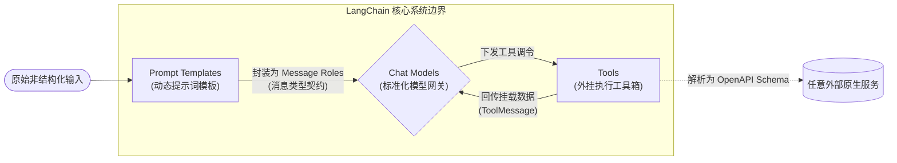
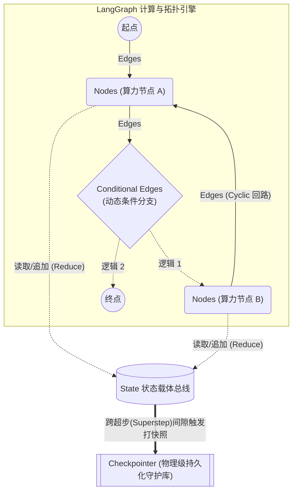
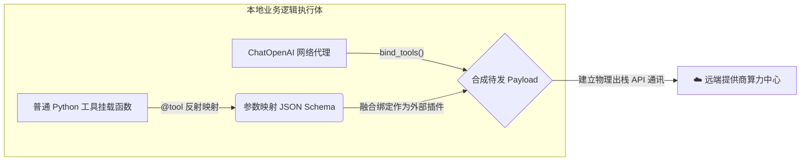
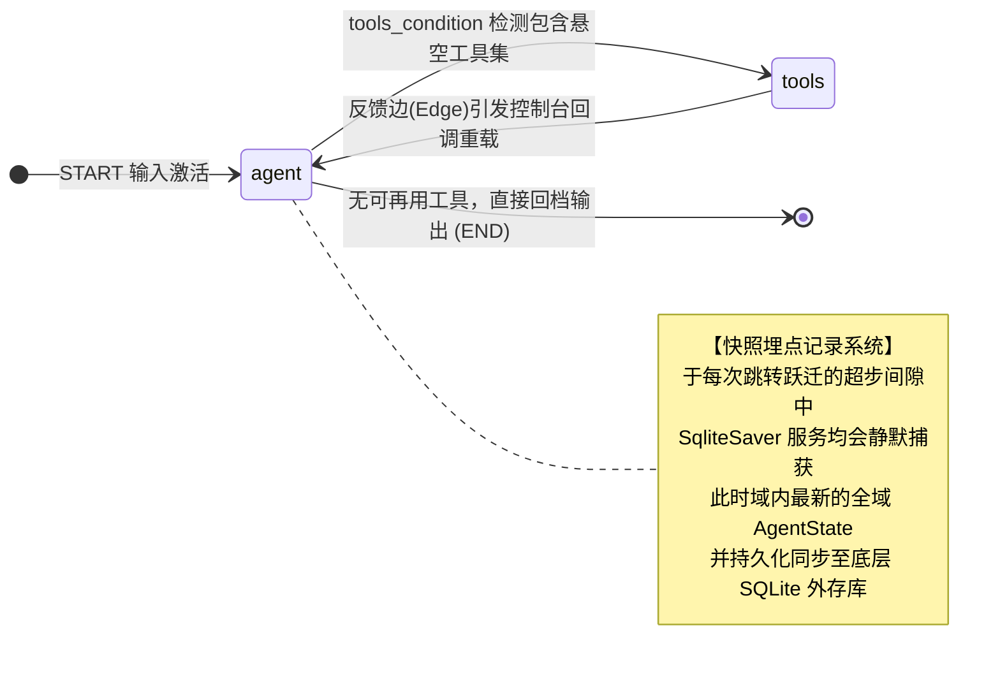

# LangChain & LangGraph 智能引擎 Demo

本项目提供了一个标准化的工程实例，展示如何基于 **LangChain** 与 **LangGraph** 框架，从零构建具备状态记忆、自主推理以及外部工具调用能力的 **ReAct (Reasoning and Acting) 智能体引擎**。

本文档将系统性阐述该工程的架构拓扑、框架底层机制、部署流程及模块测试验证方案。

---

## 🎯 系统核心功能特性清单

本工程 (`main.py`) 现已脱离基础功能校验阶段。该套代码在本地沙箱内建构并落地了以下具备工业界参考价值的集成能力：

1. **多轮对话长程记忆 (Conversational Context)**：超越了无状态（Stateless）的单次接口通信限制，支持在单一会话流内执行复杂的逻辑溯源与代词跨轮指代解析。
2. **环境感知与算力扩展 (Tool Calling)**：系统内置挂载了 `get_weather`（环境探测桩）与 `calculate`（本地数学运算挂载），有效弥补了云端语言模型（LLM）的知识时效性约束与本地运行隔离。
3. **自治推理循环机制 (ReAct Paradigms)**：引入了多阶段自我评估能力。当面临复杂指令域时，系统可自主计算调度次序、拉取外部实体答案，并携参发起下一轮溯源推理，直至满足输出收敛条件。
4. **物理断点状态容灾 (Disk Checkpointing)**：依托底层的 `SQLite` 关系型库作为挂起守护进程。每次图工作流的节点跃迁参数均被硬连接落盘持久化。在终端进程发生意外中断或物理重置的极端场景下，系统挂载库后仍可严丝合缝地恢复至最后一笔有效的交互状态。

---

## 🧠 1. 核心技术框架原理解析

### 💡 1.1 基础范式定义：Agent 与 Tool 实体解析
在深入框架底层前，需统一对大语言模型（LLM）工程开发中两项基石性概念的学术认知：
*   **Agent (智能体/自治代理)**：传统程序遵循硬编码的线性/分支树逻辑执行；而 Agent 则是将 LLM 升格为系统的“中央推理处理器”。应用不再预设僵化的执行栈边界，而是交由 LLM 结合当前全局上下文，自发地完成“感知环境 (Observe) ➔ 逻辑寻路 (Thought) ➔ 分发行动 (Action)”的动态规划循环。它赋予了系统针对非确定性突发输入的决策能力。
*   **Tool (增强工具库/外挂组件)**：云端原生 LLM 的先验知识往往受制于预训练语料的生命周期，且不具备网络侧物理入侵/查询操作能力。Tool 本质上是赋予大模型的“外挂机械义肢”（如实时天气接口、结构化 SQL 游标、定制化私有运算器）。系统通过严格序列化的接口报文，允许大模型在推理过程遇阻时，主动向物理机宿主发起外部算力侧取或三方数据抓取。

### 🧩 1.2 框架解耦与集成特性
**结论：LangChain 与 LangGraph 为松耦合架构，均支持独立运行。**
*   **LangChain 独立运用**：若业务场景专注于单向的信息转换或非循环式问答，LangChain 的链式 (Chain) 架构足以胜任协议转换与 LLM 互通。
*   **LangGraph 独立运用**：作为通用的基于图的循环应用框架，即便剥离 LLM，LangGraph 亦可用作高度复杂的非确定性工作流或有限状态机 (FSM)，其内置的检查点 (Checkpointer) 机制为状态容错提供了基础保障。

当前的工程最佳实践为**融合使用**，即将 LLM 集成于图状态引擎中，作为动态推理与全局调度的核心节点。

### 🔗 1.3 LangChain 基础原理：协议聚合与格式化中枢
LangChain 的核心定位是构建基于 LLM 应用程序的开发框架，其最大价值在于提供一套标准化的组件接口抽象以应对底层模型的异构性。

**【通用框架抽象体系图】**


**【关键通用学术术语说明】**
1. **Chat Models**：封装各大厂商异构 API 的标准化通信底层基类，提供统一的指令集收发入端口。
2. **Prompt Templates**：动态指令模板池，实现系统内生变量、记忆检索流与外部用例输入的解耦与安全装载。
3. **Tools**：赋予 LLM 交互系统外部态世界（如数据库检索、API 通信）的模块化封装接口，利用 Pydantic 编译转化使其转换为跨语言的模型调度图谱 (Schema)。
4. **Message Roles**：强制上下文链路数据按照 `System`（系统态）、`Human`（输入态）、`AI`（推理态）、`Tool`（环境态）进行严格生命周期管理的传输契约。

### 🕸️ 1.4 LangGraph 基础原理：非线性状态流转引擎
LangGraph 的使命是从根本上解决传统任务流控制编排缺乏循环干预能力的局限，它以图论（Graph Theory）为基石构建应用体系。

**【通用非线性图论流转示意图】**


**【关键通用学术术语说明】**
1. **State (状态载体)**：贯穿有向图全生命周期的全局数据总线（常约束为 `TypedDict`）。核心节点的功能基准即在于挂载并触发对数据的聚合追加 (Reduce) 与突变更新。
2. **Nodes (计算节点)**：图结构内的原子算力模块执行单元，承载模型推理、规则校验或数据转译等具体业务。
3. **Edges (拓扑连线)**：定义前继节点计算域退出后，执行线程确定性跃迁指向的连通单行道。
4. **Conditional Edges (条件路由)**：绑定评估函数的动态控制路口，依照当前时隙 State 的环境参数动态分发下一跳靶向节点。
5. **Checkpointer (持久化组件)**：超步 (Superstep) 级守护组件。支持实现执行域中断挂起（Suspend）、时空穿梭回溯（Time Travel）的物理态容错机制底层库。

### 🤝 1.5 实战分工：两者在当前框架侧的协作机制
在 `main.py` 的工程实践中，两者共同支撑了一套健壮的自治控制体系：
1. **[LangChain 执行协议层封装]**：负责数据类型的转化与下沉通讯操作。充当翻译层，屏蔽各大模型的异构底层接口，完成函数至 JSON Schema 的编译。
2. **[LangGraph 掌控状态流调度]**：负责全时域的流程编排与状态存储。通过识别返回体中的工具调令挂起事件，介入流转控制，分配运行至 `tools` 节点，并规划下一步对中枢大脑的返回路径。

简言之：**LangChain 赋予了系统感知及交互外部世界的能力组件，LangGraph 赋予了组件非线性调度与支持长稳运行的循环架构体系。**

---

## 🗺️ 2. 系统宏观交互架构

为便于更精准地厘清本 Demo 智能体引擎的空间结构，本章针对工程流向展开全域拓扑与微观子域流向的双视窗剖析。

### ⛩️ 2.1 全域跨层请求流向拓扑

下方的复合系统流程图展示了终端用户的会话状态在整个框架组间横移的过程与落点：

```text
       [  👤 用户 (User)  ]
                │
           提交文本请求
                ▼
╔════════════════════════════════════════════════════════════════════╗
║                   🕸️ LangGraph (图网络编排与状态层)                  ║
║                                                                    ║
║        ┌─────────────────────┐                                     ║
║        │ 💾 SQLite Saver     │ <== [状态持久化/加载] ==> AgentState  ║
║        └─────────────────────┘                                     ║
║                                                                    ║
║          [ START 节点 ]                                            ║
║                │                                                   ║
║                ▼                                                   ║
║      ┌──────────────────┐             ┌──────────────────┐         ║
║   ┌─>│   Agent 节点     │  决策路由   │   Tools 节点     │<┐       ║
║   │  │ (负责推理与控制流) │ ─────────> │  (本地受控函数集)│ │       ║
║   │  └──────────────────┘             └──────────────────┘ │       ║
║   │            │                                  │        │       ║
║   └────────────|──────────────────────────────────┘        │       ║
║     (无工具调用挂起)│               (工具执行完毕，注入上下文状态)│     ║
║     生成最终响应 ▼                                               │     ║
║          [ END 节点 ]                                              ║
╚════════════════│════════════════════════════════════┬══════════════╝
                 │(封装 Prompt                        │(注测 @tool
                 │ 与 State)                          │ 工具集字典)
                 ▼                                    ▼
╔════════════════════════════════════════════════════════════════════╗
║                   🔗 LangChain (协议适配与底层基建层)                ║
║                                                                    ║
║    [ ChatOpenAI ] <========================> [ bind_tools() ]      ║
║    (大语言模型通信网关)                                              ║
╚════════════════│═══════════════════════════════════════════════════╝
                 │(发起标准 HTTP API 请求)
                 ▼
          [ ☁️ 云端大语言模型 ]
     (如 DeepSeek / OpenAI / Claude)
```

**【系统架构流转逻辑概述】**
1. **请求接入 (Entry Domain)**：系统捕获用户侧发起的自然语言输入，将其转化为标准化事件序列，并借由图对象的 `START 节点` 实施初始状态数据注入（State Injection）。
2. **状态编排 (Orchestration Engine)**：应用级的控制流与状态分发由 LangGraph 引擎接管。执行线程涉入 `Agent 节点` 前，系统调用底层规约器（Reducer）与持久化组件（Checkpointer），完成全量历史上下文数据的聚合还原。
3. **协议适配与请求调度 (Protocol Translation)**：针对远端推理模型接口的通信指令交由 LangChain 核心层代理拦截。基于 `bind_tools()` 能力栈，框架完成本地宿主环境函数的模式（Schema）映射装载，并作为同源网关，向目标侧大语言模型发送符合国际标准的网络序列化数据包（Payload）。
4. **自治闭环寻路 (ReAct Feedback Loop)**：当服务端响应内含有确切的工具调用参数实体（Tool Calls）时，LangGraph 预置动态路由将捕获该标识并中断初级推理链，将控制流直接重定向（Redirect）至 `Tools 节点` 执行。待本地沙盒计算完成且收到信号器返回后，系统基于有向反馈边（Feedback Edge）强制触发下一世代的反向二次观测循环，直至触发预设的逻辑退出边界特征量，执行结果下发至调用端。

### 🔬 2.2 核心子域在工程源码侧的具象机制映射

在 `main.py` 内部，两大理论架构被工程化落地的细片渲染视景如下。

**1. LangChain 域内：关于底层函数装配流转截面**
展现了原生函数如何经由装饰器跃出本地语境：


**2. LangGraph 域内：状态存储节点在环形拓扑面的落点**
展现了环形结构下状态引擎数据库的高频持久化策略：


---

## 🚀 3. 快速上手配置指南

### 3.1 工程目录结构
```text
lang-chain-graph/
├── main.py            # 核心业务逻辑脚本：包含图节点定义、状态管理及主循坏启动逻辑
├── requirements.txt   # 组件与版本约束清单
├── .env.example       # 环境变量参考模板 (.env 构建基础)
└── README.md          # 项目规约与系统说明文档 (本文档)
```

### 3.2 环境部署工作流
项目要求运行环境 Python 环境高于 3.10。部署步骤如下：

```bash
# 1. 初始化虚拟环境并激活
python3 -m venv venv
source venv/bin/activate

# 2. 安装工程依赖库
pip install -r requirements.txt

# 3. 配置认证鉴权凭证 (默认代码驱动采用兼容 OpenAI 协议的 DeepSeek API)
cp .env.example .env
# 请编辑生成的 .env 文件，修改 DEEPSEEK_API_KEY 字段为实际有效的鉴权密钥
```

---

## 🔄 4. 调度机制与功能验证

正确加载鉴权配置后，可通过执行 `python main.py` 启动本地进程交互系统。
我们建立了一套**三阶黑盒分层验证架构**以测试系统核心功能可用性：

| 测试链路级别 | 覆盖范围场景测试用例 | 所预期的链路反馈表现 |
| :--- | :--- | :--- |
| **Stage 1: 纯图连通与通信验证** | `“你好。”` | 模型无需触发外部接口申请。路由校验分支直接引流至 `END`，返回直出的问候字符串。 |
| **Stage 2: 动态多分支与组件介入** | `“上海目前的天气状况如何？”` | 模型陷入知识空白，向上提交工具调用凭据。LangGraph 路由重定向执行分支至 `tools` 节点，加载本地参数查询运算（如命中预设温度 25°C）后，重组回送至 Agent 内核处理最终下发。 |
| **Stage 3: 磁盘持久化机制效验** | `“取刚才当地的气温数值乘以十。”` | **验证跨轮回溯与算力介入**。引擎底层通过 Sqlite 快照复现历史 25°C 上下文，随后模型生成 `calculate` 调度任务。跨回合逻辑串联无丢失报错。 |

---

## 📖 5. 核心 API 参考手册 (附录)

本章节索引了在源代码 `main.py` 实践中用以构建设施的核心类库资源。

**【架构态与流程路由层 (langgraph.*)】**
*   `StateGraph`: 定义工作流生命周期的图级容器实例抽象。
*   `add_node()` / `add_edge()`: 在图空间内定义处理任务域及强静态有向边连接方法。
*   `add_conditional_edges()`: 定义条件分路映射方法。实现由函数返回值自动推导出的异构边跳转逻辑。
*   `tools_condition`: 标准预置路由验证器，判断在最新一跳 `AIMessage` 回溯列表中是否存留工具申请列表字段。
*   `MemorySaver` / `SqliteSaver` (langgraph.checkpoint.*): 检查点记录与数据库驱动实例。为工作流提供长时挂机保障及复位还原能力。

**【大模型栈与工具映射层 (langchain.*)】**
*   `@tool` (langchain_core.tools): Pydantic 描述生成元装饰器，把原始模块级方法定义外放封装并转换成 LLM 可理解的函数类型定义 Schema。
*   `ChatOpenAI` (langchain_openai): 适配遵循 OpenAI 基本规范的标准模型调用库封装代理 (适配含 DeepSeek/OpenAI 等实现)。
*   `bind_tools()`: 将实例对象与注册之 `@tool` 表进行软硬件耦合绑定的入口级调用方法。
*   `ToolNode` (langgraph.prebuilt): `langchain` 函数在流向 `langgraph` 图应用层的一层官方包装器节点对象定义。
