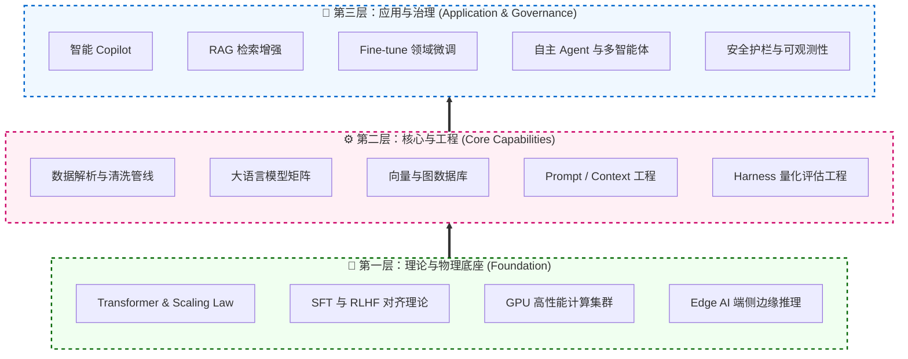
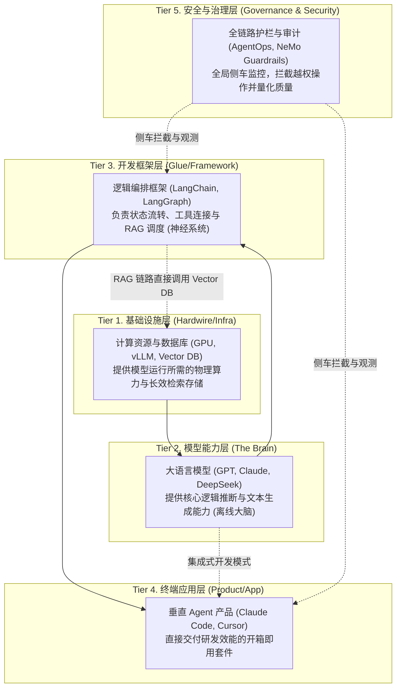
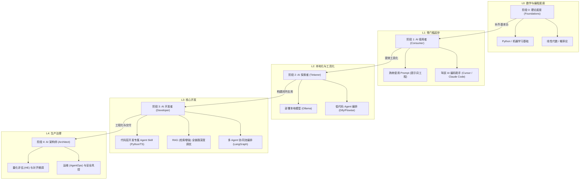
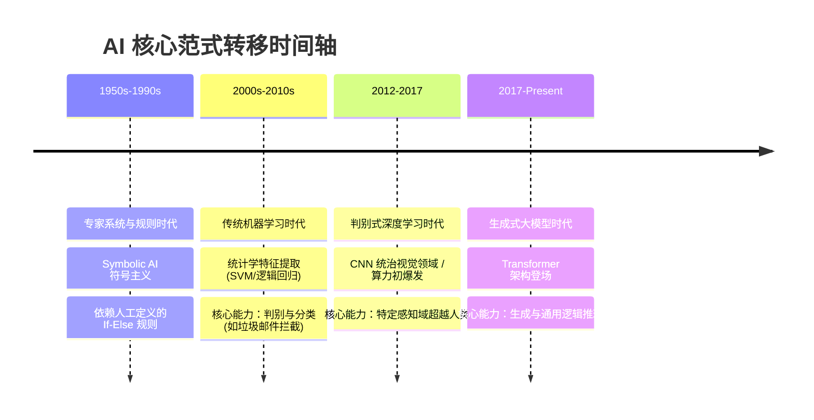
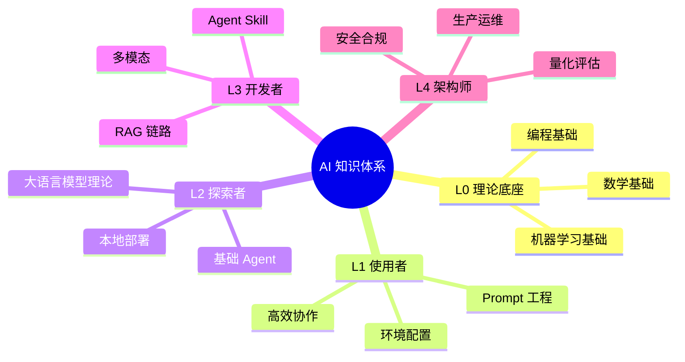
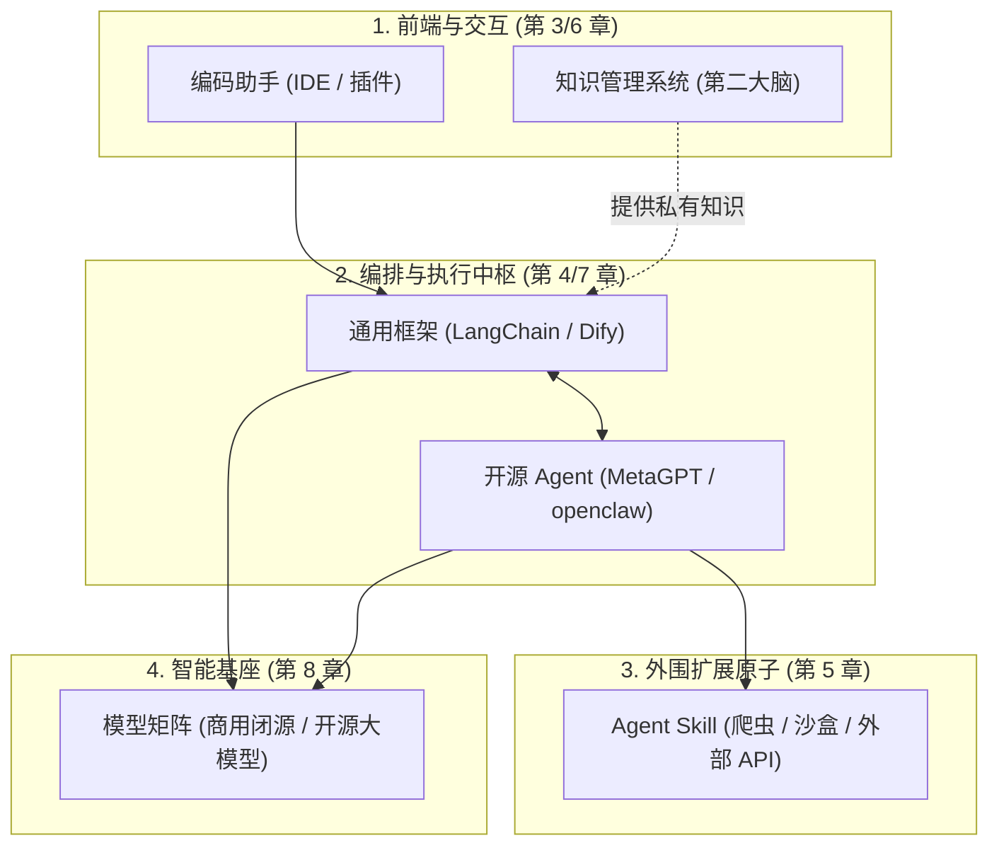
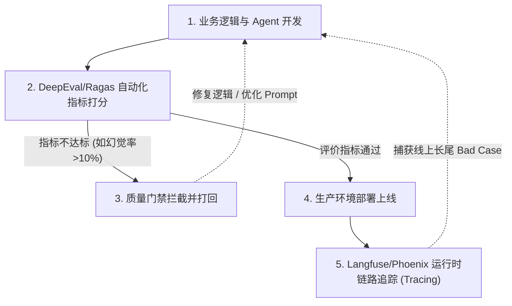
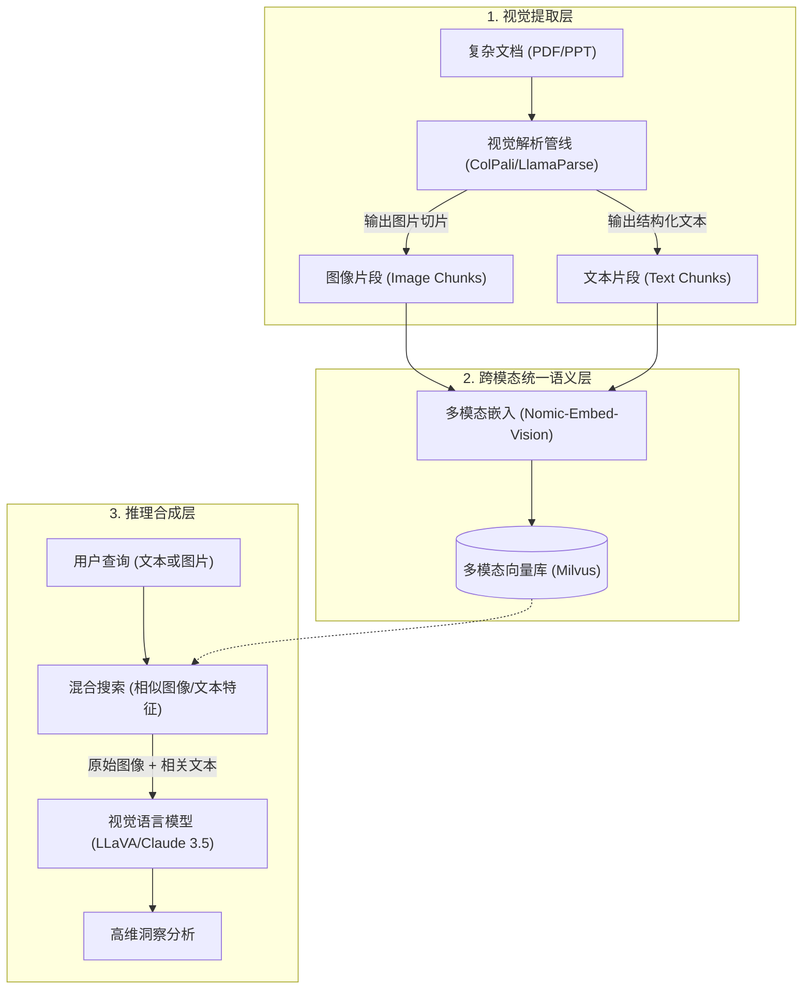
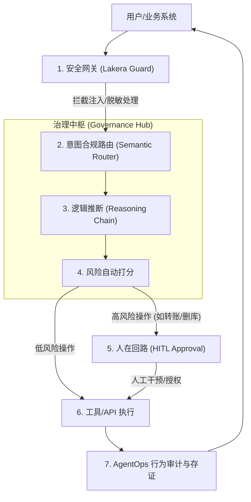
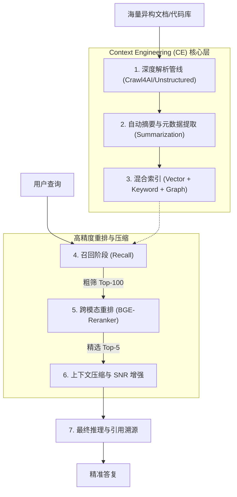

# AI 技术学习路线

> **文档定位**：面向工程师的 AI 知识体系梳理与工具全景导览，涵盖从基础原理到生产落地的完整学习路径、主流 AI 编码助手对比、开源 Skill 生态、知识管理工具及 Agent 框架全景。
> **版本**：v0.1 | **更新时间**：2026-04-24 | **维护者**：Constantine

---

<!-- 目录：在支持 [TOC] 的平台（如 Typora、GitLab）中自动渲染 -->
[TOC]

---

# 🌟 第一篇：理论与基座
> 本篇包含第 1~2 章。建议初学者精读，旨在建立 AI 技术的全局大局观与底层原理认知。

---

## 1. 导引

> **循序渐进的学习建议**：本文档按逻辑模块排列，并与学习路线图深度对齐。各阶段推荐入口：
> - **L0 入门者**：从 [知识体系](#2-知识体系) 建立理论底座
> - **L1 使用者**：通过 [编码助手](#3-编码助手) 实现即时提效
> - **L2 & L3 开发者**：通过 [通用框架](#4-通用框架) 与 [Agent Skill](#5-agent-skill) 构建闭环应用
> - **L4 架构师**：务必参考 [质量评估](#9-质量评估与可观测性)、[安全治理](#10-ai-安全与治理) 及 [企业级架构](#114-企业级架构)

### 1.1 系统图谱

#### 1.1.1 技术全景

作为本路线图的“北极星”，下图将 AI 全栈技术拆解为从“物理底座”到“应用上层”的六大关键维度，帮助您理清各模块间的模式与依赖关系。



| 架构层级 | 全景维度名称 | 大白话解释 (解决什么核心问题) | 涵盖的典型技术栈/理念 |
|:---|:---|:---|:---|
| **第一层：基座** | 1. 科学原理 | 决定模型智商上限的物理公式与训练理论。 | Transformer、Scaling Law、对齐 |
| **第一层：基座** | 2. 基础设施 | 支撑 AI 高吞吐运行的硬件肌肉。 | GPU、统一内存、端侧 NPU |
| **第二层：核心** | 3. 数据与模型 | 提供“世界知识”与“推理脑力”的原材料。 | 向量库、基础大模型、爬虫管线 |
| **第二层：核心** | 4. 研发工程 | 驯服 AI 的缰绳，防止模型胡言乱语的调教手段。 | Prompt/Context/Harness 工程 |
| **第三层：应用** | 5. 应用架构 | 封装能力，交付给最终业务用户的产品形态。 | RAG、Copilot、多智能体 |
| **第三层：应用** | 6. 安全与治理 | 企业上线的“刹车片”，确保数据不泄露、行为不失控。 | 护栏、HITL 审批、日志审计 |

#### 1.1.2 架构层级

上图展示了技术全景的**横向分类**，下图则从**纵向依赖关系**解析各层级如何协同工作。将 LLM (模型)、框架 (Framework) 与终端产品 (Product) 的关系视为一套由底层至应用端的递进式技术栈：



*   **Tier 1 基础设施 (Infra)**：物理底座。它为模型训练与推理提供算力（GPU），同时通过向量数据库（Vector DB）为系统提供长效的“记忆”存储能力。
*   **Tier 2 模型能力 (LLM)**：大脑中枢。它极其聪明但“与世隔绝”——本质是离线的概率预测机，既不知道企业私有数据，也不具备操作电脑终端的能力。
*   **Tier 3 开发框架 (Framework)**：神经桥梁。它通过标准化的协议（如 MCP）与工具编排，让离线的大脑能够感知外部数据（如 RAG）、调用外部工具（如执行 Python），从而形成逻辑闭环。
*   **Tier 4 终端应用 (Product)**：用户界面。基于底层封装好的开箱即用软件，直接交付生产力（如直接修改本地代码的 Cursor 助手）。
*   **Tier 5 治理与护栏 (Governance)**：全局监控。横跨所有执行层的“侧车 (Sidecar)”。由于大模型具备随机性，必须通过这一层来拦截恶意越权操作（Guardrails），并记录所有决策链路（Tracing）以便后期复盘。

### 1.2 学习路线

对于 AI 新手而言，建议遵循以下四个阶段逐步建立从工具使用到系统架构的能力。每个阶段都包含具体的学习目标与推荐实践：



### 1.3 技术演进

对于新手而言，理解“为什么是现在？”非常关键。AI 的进化并非一蹴而就，而是经历了几次核心的范式转移：



从**人工写逻辑**，到**机器找特征**，再到**机器自主涌现逻辑**，大模型不仅知道“什么是代码”，还能基于其掌握的超宽视野上下文进行意图推断与架构重构。

### 1.4 核心原理拆解

在深潜至大量的工具与框架库前，工程师需要建立以下几个核心的系统化直观认知，它们是驱动整套 AI 技术图谱运转的底层架构基础：

#### 1.4.1 Transformer
当前统治 AI 浪潮的大型语言模型（LLM），其核心均脱胎于 Google 于 2017 年提出的 Transformer 架构。区别于早期的 RNN（循环神经网络）基于时序的串行处理，Transformer 的核心创举在于引入了 **自注意力机制 (Self-Attention)** 并且实现了高度的并行化。
这意味着，当模型在处理句子中的任意一个 Token 时，它会通过生成特定维度的 $Q, K, V$ (Query, Key, Value) 向量来计算与上下文中 **所有其它 Token** 的权重（Attention Score）。这种机制赋予了模型超强的高维语境长程关联能力。正因剥离了时序限制，人类才得以利用数以万计的 GPU 集群并发计算。

   ```mermaid
   graph TD
       subgraph Transformer_Self_Attention ["Self-Attention (自注意力机制) 核心链路"]
           X["输入句子中的全量 Token"] --> Q["Query 矩阵<br>(当前词需要补充什么周围特征？)"]
           X --> K["Key 矩阵<br>(当前词自身属于什么特征？)"]
           X --> V["Value 矩阵<br>(当前词承载的实际语义)"]
           
           Q --> Dot["矩阵点乘积 (Dot Product)"]
           K --> Dot
           
           Dot --> Softmax["Softmax 计算全局注意力权重"]
           Softmax -- "按照权重分配上下文" --> Sum["聚合出包含整个句子时空的全新语义表达"]
           V --> Sum
       end
   ```

> **直观类比 (Library Analogy)**：
> 可以将 $Q, K, V$ 理解为在图书馆找书：
> *   **Query ($Q$)**：你想找的主题（例如“如何修电脑”）。
> *   **Key ($K$)**：书架上每本书的**封面/索引**。
> *   **Value ($V$)**：每本书里**具体的知识内容**。
> *   **Attention**：你的需求 ($Q$) 与封面 ($K$) 的匹配度。匹配度越高，你就越关注这本书的内容 ($V$)。

---

#### 1.4.2 Tokenizer
模型并不直接“阅读”人类的文字，所有的输入必须首先通过 **Tokenizer (分词器)** 转化为模型引擎能够处理的数字 ID（词元，即 Token）。
*   **物理意义**：Token 是模型计算和计费的基础单元。1 个英文单词大约对应 1.3 个 Token，而汉字通常对应更多 Token（约 2-3 个）。这也就是英文 Prompt 费用通常更低的原因。
*   **资源限制**：模型的**上下文窗口 (Context Window)** 是指单次请求它能记住的最大 Token 数量。超出该限制，最早的信息会被截断或遗忘。

> **工程师视角 (Data Reality)**：
> 在进入模型神经网络前，字符串会变成一串数字索引：
> ```text
> "Hello AI" -> [15496, 11502]
> ```
> 词表（Vocab）就像一本超大的字典，每个数字都指向一个特定的语义片段。

#### 1.4.3 预测与涌现
现代大模型的智能进阶遵循 **规模法则 (Scaling Law)**：即当训练算力、参数规模与高质量数据量同步越过特定的物理阈值后，模型会突然表现出在小模型上不曾具备的“逻辑顿悟”——即 **涌现能力 (Emergent Abilities)**。

从技术实现看，大模型依然基于 **Next-Token Prediction (预测下一个词元)** 的闭环。模型通过海量预训练，将人类知识库压缩至高维神经网络的显式概率矩阵中。当系统处理输入时，本质是在已有上下文 (Context) 引导下，通过概率采样生成**最符合逻辑的下一个 Token**。由于这种生成机制基于概率映射而非硬性的真值查询，也决定了模型内生性地存在“幻觉 (Hallucination)”现象。
   ```mermaid
   graph LR
       A["User Input: The sky is"] --> B{"Transformer 神经网络<br>(高维概率空间推断)"}
       B -- "置信区间 95%" --> C["blue"]
       B -- "置信区间 4%" --> D["dark"]
       B -- "置信区间 1%" --> E["falling"]
       C --> F(("Output: blue"))
   ```

> **直观理解 (Probability Choice)**：
> 当你输入 "The sky is" 时，模型并不是在查字典，而是在做概率选择：
> *   "blue": 92% (高概率)
> *   "cloudy": 5% (中概率)
> *   "falling": 1% (低概率)
> 模型根据 **Temperature (温度)** 参数来决定是选最稳的那个，还是偶尔选个“有创意”的。

---

#### 1.4.4 数据解析与清洗
大模型本质上只能处理纯文本 Token。但在真实业务中，知识往往沉淀在排版复杂的 PDF、带广告的网页或充满噪音的图文研报中。如果直接将这些未经处理的原始数据输入模型，会导致严重的“垃圾进、垃圾出 (Garbage In, Garbage Out)”。
因此，在进行高级向量化运算前，必须经过一道极其关键的工序——**数据清洗管线 (Data Cleaning Pipeline)**：
1. **解析提取**：利用 `Unstructured` 等工具或视觉大模型（如 `LlamaParse`）将复杂文档还原为纯净的 Markdown。
2. **智能切块 (Chunking)**：由于模型有上下文长度限制，清洗后的长文档会被按语义切分为多个语义片段（Chunks），以便后续精确检索。
如果没有这道数据预处理管线，后续再高级的 RAG 或 Agent 架构都将缺乏可靠的数据根基。

> **工程师视角 (Data Cleaning)**：
> 数据清洗的核心是将杂乱的质料转化为纯净的 Markdown，以大幅提升“信噪比”：
> *   **原始数据**：包含页眉页脚、侧边栏广告、排版错位的表格、HTML 标签等。
> *   **清洗后**：`# 季度财报分析 \n ## 核心盈利能力 \n - 净利润增长 15% \n - 营收达 200 亿...`
> 只有这样，后续的向量化（Embedding）才能精准捕捉语义“信号”，而不是被“噪音”带偏。

---

#### 1.4.5 向量嵌入
经过上述管线清洗并切块后的纯净文本，接下来就需要通过数学手段转化为机器能懂的语言。如果说 Tokenizer 让模型认识了文字，那么 **Embedding (向量嵌入)** 则赋予了机器理解“语义”的数学桥梁。
Embedding 算法（如 OpenAI 的 `text-embedding-3`）会将一段文本映射为一个高维（例如 1024 维）的浮点数向量，并将其投射在一个多维语义空间坐标系中。在空间里，两段意义相近的话（如“苹果设备”与“iPhone”）几何距离极近，而差异悬殊的词汇（如“苹果”与“挖掘机”）距离很远。

*   **多模态原理**：通过统一的对齐训练（如 CLIP 算法），可以将图像、声音特征映射进与文本相同的**高维语义空间**。这意味着模型可以在完全不识别文字的情况下，通过计算向量距离，直接发现“一张猫的图片”和“英文单词 cat”在数学上是同一个东西。

> **工程师视角 (Data Reality)**：
> 向量化后的数据在底层实际上就是一个**浮点数数组**。所谓的“计算语义相关性”，在代码层面就是计算两个数组的余弦相似度：
> ```python
> # 文档语义的数学表达
> doc_1_vector = [0.12, -0.59, 0.88, ..., 0.01]  # 代表 "苹果手机"
> doc_2_vector = [0.13, -0.57, 0.82, ..., 0.03]  # 代表 "iPhone"
> doc_3_vector = [-0.8, 0.11, -0.3, ..., 0.99]   # 代表 "挖掘机"
> 
> # doc_1 与 doc_2 的向量距离极近 -> 语义相关
> ```

*   **核心价值**：Embedding 是跨越字面搜索走向**语义搜索**的基础，更是支撑当前 RAG 架构、推荐系统以及 Agent 意图路由（Semantic Router）的核心底层技术。

---

#### 1.4.6 对齐、微调与量化
预训练 (Pre-training) 赋予模型海量通识知识，而 **对齐 (Alignment)** 则负责将这个庞大的知识库训练为一个能够理解并遵循人类指令的服务系统。
*   底座模型仅具备概率续写能力。经过 **SFT (监督微调)** 注入指令格式，再经过 **RLHF** 或 **DPO** 注入人类价值观。
*   **PEFT (参数高效微调)**：如 LoRA 等技术允许工程师仅使用单张显卡，局部更新极小权重，使大模型快速适配特定领域的专业逻辑。

> **直观类比 (Sticker Analogy)**：
> 把底座模型想象成一台沉重的**大型服务器**（不可轻易改动权重）。**LoRA** 就像是在服务器外壳上贴了一张**薄薄的贴纸**。贴纸虽然很轻，但能改变机器的外观和标识。在推理时，模型会同时读取“服务器”和“贴纸”的信息，从而表现出特定的领域能力。

*   **量化 (Quantization)**：为何消费级显卡能跑千亿大模型？通过降低权重的计算精度（如从 FP16 降至 INT4/AWQ 格式），在损失极微小性能的前提下，成倍压低模型运行的显存占用，是本地化部署的核心妥协哲学。

---

#### 1.4.7 本地推理与部署
理解了量化原理后，自然就会产生一个问题：**量化后的模型文件如何在自己的电脑上跑起来？** 这正是本地推理生态要解决的核心问题。

*   **GGUF 格式**：目前最主流的本地模型权重文件格式。它将模型参数以极致压缩的方式打包，专为 **CPU 与消费级 GPU** 的快速加载而设计。几乎所有本地推理工具都以 GGUF 作为标准输入格式。
*   **Ollama**：当前最流行的本地模型一键运行工具。它将模型下载、量化版本管理与 REST API 服务封装为一条命令（如 `ollama run deepseek-r1`），开发者无需关心底层细节即可在本地启动一个兼容 OpenAI 接口的推理服务。
*   **Apple MLX**：苹果官方专为 **Apple Silicon (M 系列芯片)** 的统一内存架构打造的机器学习框架。由于 Mac 的 CPU 与 GPU 共享同一块内存（Unified Memory），MLX 能够绕过传统显卡的显存瓶颈，在 M2/M3/M4 芯片上以极低功耗高效运行中大规模模型（如 32B 级别），使 Mac 成为 AI 开发者极具竞争力的本地工作站。
*   **LM Studio**：提供图形化界面的本地模型管理平台，支持一键下载 Hugging Face 上的 GGUF 模型并进行交互式对话测试，适合偏好可视化操作的开发者。

> **显存估算公式**：全精度 (FP16) 下 1B 参数约占 2GB 显存；INT4 量化后 1B 约占 0.7GB。因此，一张 24GB 显存的 RTX 4090 即可流畅运行 32B 级量化模型。

---

#### 1.4.8 检索增强生成
为解决大模型缺乏领域私有知识以及易产生幻觉的局限性，RAG (Retrieval-Augmented Generation) 提供了一种确定性的工程路径。
系统首先将用户的 Query **向量化 (Embedding)**，去外部向量数据库中检索距离最近的数据切片（工业界普遍采用 **HNSW 近似最近邻算法** 以实现百万级向量的毫秒级检索）。随后，以 **LangChain** 或 **LlamaIndex** 为代表的框架会将召回的文本与 Query 组合成极具信息密度的上下文，注入给模型进行推理。

> 这种“带答案投喂”的方式有效解决了模型对私有数据的认知空白。

*   **高级检索优化 (Advanced RAG)**：
    *   **检索前处理 (Pre-retrieval)**：通过 **Query Rewriting (查询重写)** 将用户模糊的问题转化为多个精确的语义向量，或利用 **HyDE (Hypothetical Document Embeddings)** 生成假设性文档以增强匹配度。
    *   **检索后重排 (Post-retrieval)**：利用 **Reranker (重排序模型)** 对向量数据库返回的 Top-K 结果进行二次精排，通过深度语义理解剔除相关度较低的噪音，极大提升最终 Prompt 的信噪比。


为了量化 RAG 系统的可靠性，业界通常采用 **RAGAS** 评估标准，重点观测四大核心指标：上下文召回率 (Context Recall)、上下文精确率 (Context Precision)、忠实度/防幻觉 (Faithfulness) 以及答案相关性 (Answer Relevance)。

   ```mermaid
   graph TD
       Q["用户查询 (Query)"] --> Embed["Embedding (将文本变为向量)"]
       Embed --> R["向量数据库 (Vector DB)<br>基于 HNSW 算法的近似检索"]
       Q --> P["提示词渲染 (Prompt Templating)"]
       R -- "返回 Top-K 特征片段" --> P
       P -- "组件: LangChain/LlamaIndex 编排" --> L["大语言模型 (LLMs)"]
       L --> A["可溯源的准确应答 (Ground Truth)"]
   ```

#### 1.4.9 自主智能体
大模型本身是离线的推理引擎。**智能体 (Agent)** 架构能赋予模型调度工具与执行终端操作的能力。

*   **核心本质**：Agent 是从“确定性编程”向“意图驱动编程”的跨越。传统程序是 `If-Then` 的硬编码逻辑；而 Agent 是将模型作为一个**动态决策单元 (Reasoning Engine)** 嵌入到循环中。
*   **驱动逻辑**：核心依赖于 **ReAct (Reasoning and Acting)** 理论范式及 **Function Calling** 协议。模型通过思考输出下一步该做什么，观察结果后继续思考，直到达成初始目标。

> **工程师视角 (Data Reality)**：
> **模型本身并不直接执行代码**。它只是通过推理，决定“现在该用什么工具”，并输出一段约定的 JSON 指令。真正的执行动作（如发送 HTTP 请求或删除文件）是由开发者编写的宿主程序完成的：
> ```json
> // 模型输出的指令 (并非执行动作本身)
> {
>   "action": "search_weather",
>   "parameters": { "city": "Shanghai", "unit": "celsius" }
> }
> ```

Agent 的核心组件可拆解为五大层次：

| 组件 | 角色 | 典型技术 |
| :--- | :--- | :--- |
| **感知层 (Perception)** | 接收外部输入（文本、图像、工具返回值），形成当前上下文 | 多模态输入、DOM 解析 |
| **大脑 (Brain)** | 理解意图、决策与推理，是 Agent 的指挥中心 | GPT、Claude、DeepSeek |
| **工具 (Tools)** | 将决策转化为真实动作的执行单元 | 搜索、代码执行、API 调用 |
| **记忆 (Memory)** | 维持上下文状态与长期演进。**短期记忆** (对话滑动窗口) + **长期记忆** (带有聚类压缩与重要性衰减遗忘的 Vector DB) | Chroma、Milvus、Mem0 |
| **规划 (Planning)** | 将复杂任务拆解为可执行的步骤序列 | CoT、ReAct、Tree of Thoughts |
| **连接 (Connection)** | 标准化工具调用与多智能体通信协议，MCP (Model Context Protocol) 正在成为行业标准的“AI USB接口” | MCP、A2A |

在工程实现上，存在两条并行路径：
1.  **独立/垂直 Agent (Standalone Agents)**：如 **Claude Code**、**Cline** 等，**不依赖通用编排框架**，原生深度耦合环境，交付业务侧极致体验。
2.  **通用编排框架 (Agentic Frameworks)**：如 **LangGraph**、**AutoGen** 等，提供标准化状态机原语，供开发者利用代码构建定制多步协作系统。

以下是 Agent 运行循环 (Agent Loop) 的完整流程，展示了感知—思考—行动—观察的迭代闭环：

   ```mermaid
   graph TD
       P["👁️ 0. 感知层 (Perception)<br>接收文本/图像/工具返回值"] --> T["1. 状态推断 (Thought)<br>意图解析与工具链选择"]
       T -- "派发指令 (如 Fn-Calling/MCP)" --> A["2. 代理执行 (Action)<br>运行时边界执行 API/脚本/事务"]
       A -- "产生日志或返回值" --> O["3. 观测反馈 (Observation)<br>执行结果回写至对话上下文"]
       O -- "触发下一轮推断" --> T
       T -- "评估证据链闭环" --> E["4. 任务终结 (Final Output)"]

       M["🧠 记忆系统 (Memory)<br>短期: 对话窗口 | 长期: Vector DB"] -. "贯穿始终" .-> T
       M -. "状态持久化" .-> O
   ```

#### 1.4.10 提示词工程
提示词工程并非简单的“调教话术”，其背后是 LLM 的底层运行机理——**上下文学习 (In-Context Learning, ICL)**。

*   **核心原理**：大模型本质是一个超大规模的概率预测器。Prompt 的作用是通过提供背景信息、指令和示例，**强行干预模型内部神经元的激活概率**，将输出空间“折叠”到用户预期的子集内。
*   **推理启发**：如 **CoT (Chain of Thought)** 能够通过强制模型输出推理过程，利用其自身的注意力机制挖掘出隐藏在权重深层的逻辑链路，从而解决原本无法直接回答的复杂数学或逻辑问题。

#### 1.4.11 智能体记忆架构
Agent 的“灵魂”在于其能够跨越单次推理的限制，形成持久化的认知。
*   **感官记忆 (Sensory)**：模拟人类瞬时感知，主要处理流式输入的原始信号（如多模态流）。
*   **短期记忆 (Short-term)**：即**工作记忆 (Working Memory)**，通常基于 LLM 的上下文窗口实现。通过**对话历史管理**（如滑动窗口、Token 计数截断）维持当前任务的连贯性。
*   **长期记忆 (Long-term)**：基于**向量数据库 (Vector DB)** 的外部存储。通过 Embedding 匹配检索数月甚至数年前的知识。
*   **记忆管理策略**：
    *   **重要性评估**：并非所有信息都值得保存，Agent 需自主评估内容的价值密度。
    *   **增量总结**：定期将散乱的对话历史压缩为结构化的事实或用户画像片段。
    *   **衰减遗忘**：模拟生物遗忘曲线，对低频、低价值的记忆进行权重下调甚至物理删除，确保存储效率。

#### 1.4.12 多智能体协作与标准
单体 Agent 存在能力边界，**多智能体系统 (MAS)** 通过分工协作解决复杂博弈问题。
*   **协作范式**：
    *   **层级式 (Hierarchical)**：由一个 Orchestrator (调度者) 负责拆解任务并指派给专家级 Subagents。
    *   **平级式 (Peer-to-Peer)**：Agent 之间地位对等，通过消息总线或群聊模式自主协商。
*   **核心协议**：
    *   **MCP (Model Context Protocol)**：行业标准的“AI USB 接口”，实现了工具服务器、数据源与 AI 模型之间的解耦。Host 只需接入 MCP Server，即可立即获得跨平台的工具调用能力。
    *   **A2A (Agent-to-Agent)**：定义了智能体之间进行任务握手、状态同步及能力发现的语言。


---

### 1.5 工程体系
现代 AI 研发衍生出了确保系统鲁棒性与边界可控的四大工程学派，它们是将 Demo 演进为企业级生产应用的核心保障。下图展示了从输入约束、安全治理到质量审计的完整反馈闭环：

   ```mermaid
   graph TD
       subgraph 1_输入约束 ["⬆️ 1. 输入层 (投喂级基建)"]
           PE["Prompt Engineering<br>(Few-shot / CoT)"]
           CE["Context Engineering<br>(向量排序 / 信噪比 SNR)"]
       end
       
       subgraph 2_推理内核 ["⚙️ 2. 推理沙盒"]
           LLM["Large Language Model<br>(自回归 / 对齐)"]
       end

       subgraph 3_安全拦截 ["🛡️ 3. 治理与护栏"]
           GE["Governance Engineering<br>(拦截越权操作 / RBAC)"]
       end
       
       subgraph 4_验收审计 ["⬇️ 4. 质量审计"]
           HE["Harness Engineering<br>(客观指标评价平台)"]
       end

       PE --> LLM
       CE --> LLM
       LLM --> GE
       GE -. "违规拦截" .-> LLM
       GE --> HE
       HE -. "分数不达标触发退回/重试" .-> PE
   ```

#### 1.5.1 提示词工程
将非结构化的自然语言固化为确定性的系统约束。工业级领域重点运用隔离库 (Few-Shot)、XML 标签划定安全边界、思维链 (CoT) 等强逻辑约束手段，从而最大程度压低模型生成侧的随机熵（Entropy）。

#### 1.5.2 上下文工程
在超长上下文时代，将海量原始质料全量无差别输入给模型的执行效率极低。Context Engineering 致力于 **信噪比 (SNR)** 的精算治理。系统通过混合检索 (Hybrid Reranking) 与智能截断等流水线管道，确保决定性代码与逻辑分支处于模型注意力的最高效波段内，从根本上防止“大海捞针”效应导致的信息耗散。

#### 1.5.3 测试评估工程
Harness Engineering 致力于在交付层构筑标准化拦截准则与自动化评估测试台。系统借由 DeepEval、Ragas 等评估框架，将非确定性的文字回复转化为可机读、可度量的数值指标（如幻觉发生率、事实忠诚度 Faithfulness）。建立此准出流水线是 AI 摆脱原型玩具限制、走向企业核心生产流水线的终极门槛。

#### 1.5.4 治理与安全工程
Governance Engineering (治理工程) 是防止大模型“作恶”或“被利用”的最后一道物理防线。由于大模型生成具有概率随机性，企业级系统必须在沙盒外侧套上“安全护栏 (Guardrails)”，通过 RBAC (基于角色的权限控制)、恶意意图识别与全链路审计 (Tracing)，确保 Agent 的所有工具调用行为均被严格约束在合规边界内。


---

## 2. 知识体系

> 构建从理论基座到高级架构的全栈 AI 知识图谱，旨在为开发者提供结构化的技术演进路径。



> **阅读提示**：为了降低认知负荷，庞大的知识体系已按学习阶段（L0 → L4）进行拆分。建议优先关注「知识点」和「说明」列，建立宏观认知。

### 2.1 L0: 理论底座
| 知识点分类 | 知识点 | 知识点说明 | 应用场景 | 主流开源项目及链接 | 
|:----------:|:------:|:----------:|:--------:|:----------------------:|
| 数学基础 | 线性代数 | 向量、矩阵乘法、特征值分解，是神经网络运算底层语言 | 神经网络权重计算 | [3Blue1Brown 线性代数](https://www.3blue1brown.com/topics/linear-algebra) |
| 数学基础 | 微积分与反向传播 | 链式法则驱动梯度下降，是深度学习训练的核心机制 | 模型训练、损失优化 | [Calculus - MIT OCW](https://ocw.mit.edu/courses/18-01sc-single-variable-calculus-fall-2010/) |
| 数学基础 | 概率论与信息论 | 极大似然估计、熵、LLM 预测下一个 Token 的概率分布 | 模型推理过程 | [StatQuest](https://www.youtube.com/@statquest) |
| 编程基础 | Python 编程 | 语法、面向对象、异步编程等，是 AI 开发的标准语言 | 框架与应用逻辑 | [Python 官方教程](https://docs.python.org/zh-cn/3/tutorial/index.html) |
| Python 库 | NumPy / Pandas | 科学计算与数据处理基石，AI 数据预处理的核心工具 | 张量运算、特征工程 | [NumPy](https://numpy.org) |
| Python 库 | Matplotlib / Seaborn | 数据可视化库，用于分析数据分布趋势等 | 损耗曲线绘制 | [Matplotlib](https://matplotlib.org) |
| 机器学习 | 统计学习 | 回归、决策树、SVM 等传统算法，是理解 ML 逻辑起点 | 垃圾邮件分类 | [Scikit-learn](https://scikit-learn.org) |
| 机器学习 | 无监督学习 | K-Means、PCA 等聚类/降维算法，处理未标记数据 | 用户分群、降维 | [Scikit-learn Unsupervised](https://scikit-learn.org/stable/unsupervised_learning.html) |
| 机器学习 | 评价指标 | Accuracy、F1、AUC-ROC 等评估模型表现的标准化体系 | 性能提升决策依据 | [Scikit-learn Metrics](https://scikit-learn.org/stable/modules/model_evaluation.html) |

### 2.2 L1: 使用者
| 知识点分类 | 知识点 | 知识点说明 | 应用场景 | 主流开源项目及链接 | 
|:----------:|:------:|:----------:|:--------:|:----------------------:|
| 工具链运用 | AI IDE | 掌握基于 Composer 机制的多文件跨库协同，熟练使用 Cursor/Copilot 等 | 全栈快速开发、代码重构 | [Cursor](https://cursor.com) / [Windsurf](https://codeium.com/windsurf) |
| 提示词技术 | Prompt Engineering | 掌握 CRISPE 等提示词框架，使用 Few-Shot 与 CoT 引导模型 | 文案生成、代码纠错 | [Prompt Engineering Guide](https://www.promptingguide.ai/zh) |
| 知识管理 | 个人知识库 | 利用 Obsidian、Notion AI 结合本地大模型进行双链知识沉淀 | 研发文档、学习笔记管理 | [Obsidian](https://obsidian.md) / [Notion](https://www.notion.so) |
| 搜索技巧 | 语义搜索 | 运用 Perplexity 等新一代 AI 搜索引擎获取带引用源的最新技术资讯 | 错误排查、竞品分析 | [Perplexity](https://www.perplexity.ai) |

### 2.3 L2: 探索者
| 知识点分类 | 知识点 | 知识点说明 | 应用场景 | 主流开源项目及链接 | 
|:----------:|:------:|:----------:|:--------:|:----------------------:|
| 深度学习 | PyTorch | 现代主流深度学习框架，支持自动微分与显存加速 | 神经网络训练 | [PyTorch](https://pytorch.org) |
| 深度学习 | TensorFlow | 工业级深度学习平台，生产部署与端侧性能较强 | 生产环境模型部署 | [TensorFlow](https://www.tensorflow.org) |
| 计算机视觉 | CNN | 卷积神经网络，空间特征提取，自动驾驶的基础 | 图像识别、目标检测 | [torchvision](https://github.com/pytorch/vision) |
| 自然语言处理 | RNN/LSTM/GRU | 循环神经网络，处理序列信息，早期翻译基础 | 文本生成、语音识别 | [PyTorch RNN](https://pytorch.org/docs/stable/nn.html#recurrent-layers) |
| 转折点技术 | Transformer | 基于 Self-Attention 的模型架构，现代 LLM 的底座 | 机器翻译、长文本 | [Attention Is All You Need](https://arxiv.org/abs/1706.03762) |
| 预训练模型 | BERT / RoBERTa | 基于编码器的预训练模型，开启大规模预训练时代 | 文本理解、NER | [HuggingFace BERT](https://huggingface.co/google-bert/bert-base-uncased) |
| 预训练模型 | Tokenization | BPE/WordPiece 等分词技术，将文本转为数字 ID | Ctx 估算 | [HuggingFace Tokenizers](https://github.com/huggingface/tokenizers) |
| 提示词工程 | 引导工程 | Few-shot、CoT 等提升 LLM 表现的技巧 | 复杂任务规划 | [Prompt Engineering Guide](https://github.com/dair-ai/Prompt-Engineering-Guide) |
| 数据基建 | 向量数据库 | 海量高维向量数据的近似最近邻检索与长效存储 | 专属知识库检索底层 | [Milvus](https://github.com/milvus-io/milvus) |
| 应用架构 | RAG | Embedding + Vector DB + LLM，解决幻觉与私有数据 | 企业专属知识库 | [LangChain RAG](https://python.langchain.com/docs/tutorials/rag/) |
| 智能体架构 | ReAct | Reasoning + Acting 循环，LLM 自主决策调用工具 | 自动化办公 | [LangGraph](https://github.com/langchain-ai/langgraph) |

### 2.4 L3: 开发者
| 知识点分类 | 知识点 | 知识点说明 | 应用场景 | 主流开源项目及链接 | 
|:----------:|:------:|:----------:|:--------:|:----------------------:|
| 大模型预训练 | LLM 训练 | Next-Token Prediction 训练，构建基础大脑 | 基础基座模型构建 | [GPT-NeoX](https://github.com/EleutherAI/gpt-neox) |
| 大模型微调 | SFT 对齐训练 | 指令微调使模型遵循人类指令，确保输出有用可信无害 | 领域垂直定制 | [LLaMA-Factory](https://github.com/hiyouga/LLaMA-Factory) |
| 大模型微调 | RLHF / DPO | 基于人类反馈的强化学习，通过偏好打分优化模型 | 价值观对齐 | [TRL](https://github.com/huggingface/trl) |
| 大模型微调 | LoRA / QLoRA | 参数高效微调，极大降低算力门槛 | 低算力微调实验 | [PEFT](https://github.com/huggingface/peft) |
| 数据工程 | 数据清洗管线 | 复杂文档（PDF/网页）的高精度解析与智能切块 | RAG 数据摄入 | [Unstructured](https://github.com/Unstructured-IO/unstructured) |
| 多模态应用 | VLM | 视觉语言大模型 (GPT-4V/LLaVA)，处理图文理解 | 视觉对话、内容理解 | [LLaVA](https://github.com/haotian-liu/LLaVA) |

### 2.5 L4: 架构师
| 知识点分类 | 知识点 | 知识点说明 | 应用场景 | 主流开源项目及链接 | 
|:----------:|:------:|:----------:|:--------:|:----------------------:|
| 模型部署 | GGUF / AWQ | 端侧与生产环境的模型压缩技术，显著降低显存占用 | 端侧部署、生产提速 | [vLLM](https://github.com/vllm-project/vllm) |
| LLMOps | 评估与追踪 | 全生命周期追踪提示词与输出质量 | 生产级状态监控 | [LangSmith](https://smith.langchain.com/) |
| 量化评估 | 测试评估工程 | 自动化量化评估 RAG 检索精准度与答案幻觉率 | 架构准出测试拦截 | [Ragas](https://github.com/explodinggradients/ragas) |
| 安全合规 | 治理与护栏 | 拦截恶意提示词注入 (Jailbreak) 与限制越权操作 | 金融/企业级生产安全 | [NeMo Guardrails](https://github.com/NVIDIA/NeMo-Guardrails) |
| 基础设施 | 算力集群 | 深入理解 H100/B200 等 GPU 算力瓶颈与显存带宽 | 基础设施规划 | [NVIDIA](https://www.nvidia.com) |

---

# 🛠️ 第二篇：生态与工具字典
> 本篇包含第 3~8 章，梳理了目前全球数以百计的高优开源 AI 工具矩阵。
> 建议无需死记硬背，请将其作为“开发黄页”和“工具字典”，在需要进行技术选型时按需查阅。

为了帮助您在海量工具中建立空间感，下图展示了第 3~8 章所列工具在现代 AI 工程技术栈中的物理分层架构：



---

## 3. 编码助手

> 深度对比当前主流 AI 原生 IDE、独立插件及终端 Agent，为研发提效提供选型参考。

| 序号 | 选型等级 | 工具分类 | 工具名称 | 核心能力说明 | 典型应用场景 | 官网/插件链接 |
|:----:|:--------:|:--------:|:--------:|:------------|:------------|:-------------|
| 1 | **L1** | AI 原生 IDE | **Cursor** | 当前全球最主流的 AI-First 独立编辑器，基于 Composer 机制的多文件跨库协同与逻辑重构性能卓越。 | 开发者个体、全栈应用快速工程化 | [Cursor](https://cursor.com/) |
| 2 | **L1** | AI 原生 IDE | **Windsurf** |由 Codeium 推出的新一代 AI IDE，采用级联风暴 (Cascade) 流水线，致力于实现无缝的上下文预测与智能编辑。| 高级架构重构、深层逻辑推断 | [Windsurf](https://codeium.com/windsurf) |
| 3 | **L1** | AI 原生 IDE | **Zed** | 采用 Rust 编写的现代化编辑器，内置高拓展性 AI 模块，旨在交付极致的响应速度与运行时效能。 | 高并发研发、追求极速反馈的极客环境 | [Zed](https://zed.dev/) |
| 4 | **L2** | AI 原生 IDE | **Qoder** | 阿里推出的 Agentic AI IDE，支持“Quest 任务挂机模式”，深度理解工程架构与历史依赖。 | 复杂架构重构、长程研发任务派发 | [Qoder](https://qoder.com/) |
| 5 | **L1** | IDE 独立插件 | **GitHub Copilot** | 微软与 OpenAI 联合打造的行业鼻祖，与 GitHub 生态深度绑定，企业级代码合规性最强。 | 传统团队开发、企业级合规项目 | [Copilot](https://github.com/features/copilot) |
| 6 | **L1** | IDE 独立插件 | **Codeium** | 免费且极其强大的代码自动补全插件，具备极高吞吐量的本地化支持，覆盖所有主流 IDE 板块。 | 多平台兼容开发、C++等重型语言 | [Codeium](https://codeium.com/) |
| 7 | **L1** | IDE 独立插件 | **Gemini (VS Code)** | Google 原生 AI 指挥端，具备深度的代码补全与超长文本视窗（依托 Gemini 1.5 Pro）。 | Google 生态开发、超长日志查错 | [Google AI Studio](https://aistudio.google.com/) |
| 8 | **L3** | 终端/系统 Agent | **Claude Code** | Anthropic 官方推出的 CLI Agent，支持代码库深度理解、复杂逻辑重构与测试自动化执行。 | 底层 Bug 修复、项目级无 UI 重构 | [Claude Code](https://docs.anthropic.com/zh-CN/docs/claude-code) |
| 9 | **L2** | 终端/系统 Agent | **WorkBuddy** | 腾讯推出的全能型桌面 AI Agent，从底层打通编程、文档检索与办公软件的全局联动工作流。 | 跨越代码域的全局企业办公自动化 | 腾讯云 |
| 10 | **L3** | 终端/系统 Agent | **Antigravity** | 强大的多模态 Agent 系统，具备超前的文件操作、浏览器自主接管与命令自动化执行能力的开发者副驾。| 端到端复杂工程流闭环 | [Antigravity](https://github.com/google-deepmind/antigravity) |
| 11 | **L3** | 插件驻留 Agent | **Cline** | 开源社区高度认可的 VS Code 自动化 Agent 插件，可自主读取全量文件、生成补丁并执行终端命令。 | 自动化构建、特性级代码推送 | [Cline (Github)](https://github.com/cline/cline) ⭐25k+ |
| 12 | **L3** | 基座与开源生态 | **OpenAI Codex API** | 将代码生成能力接口化的底层引擎服务，企业可通过 API 调用构建私有化编码工具平台。 | 定制化企业代码助手后台基建 | [OpenAI](https://openai.com/) |
| 13 | **L3** | 基座与开源生态 | **Open Claude** | 社区发起的 Claude 开源复现项目，配合本地模型旨在打造绝对数据隐私优先和高度定制化 Agent。 | 断网环境开发、私有化高度定制 | [Open Claude](https://github.com/openclaw) |

---

## 4. 通用框架

> 收录 GitHub 具备高影响力（Star）的工程化框架、工具库及关键应用组件。

| 序号 | 选型等级 | 框架分类 | 框架名称 | 框架说明 | 应用场景 | 主流开源名称及链接 |
|:----:|:--------:|:----------:|:----------:|:----------:|:--------:|:-----------------:|
| 1 | **L3** | LLM 编排 | LangChain | 最主流的 LLM 应用开发框架，标准化 Chain 和 Agent 编排 | 文档 QA、自动化流程 | [LangChain](https://github.com/langchain-ai/langchain) ⭐100k+ |
| 2 | **L2** | 本地运行 | Ollama | 本地一键运行主流开源模型，REST API 兼容 | 隐私本地推理、离线实验 | [Ollama](https://github.com/ollama/ollama) ⭐95k+ |
| 3 | **L2** | 应用平台 | Dify | 可视化编排平台，支持 Workflows 构建与后端托管 | 快速上线 AI 产品原型 | [Dify](https://github.com/langgenius/dify) ⭐80k+ |
| 4 | **L2** | 语音技术 | Whisper | OpenAI 开源的多语言工业级语音识别模型 | 字幕听写、视频翻译 | [Whisper](https://github.com/openai/whisper) ⭐70k+ |
| 5 | **L2** | 图像生图 | ComfyUI | 节点图式 Stable Diffusion 工作流 UI，完全可定制 | 广告设计、AI 绘画工作流 | [ComfyUI](https://github.com/comfyanonymous/ComfyUI) ⭐55k+ |
| 6 | **L3** | LLM 编排 | LlamaIndex | 专注数据摄入与 RAG 的枢纽框架，提供丰富的数据连接器 | 知识库检索、结构化提取 | [LlamaIndex](https://github.com/run-llama/llama_index) ⭐40k+ |
| 7 | **L4** | 推理加速 | vLLM | 高吞吐 LLM 推理引擎，支持 PagedAttention 提升显存效率 | 企业级推理 API 服务 | [vLLM](https://github.com/vllm-project/vllm) ⭐40k+ |
| 8 | **L3** | 多 Agent 框架 | AutoGen | 微软出品，支持 Agent 间自主对话与协作执行任务 | 模拟软件开发流程、自主研究 | [AutoGen](https://github.com/microsoft/autogen) ⭐35k+ |
| 9 | **L3** | 微调框架 | LLaMA-Factory | 统一的微调框架，支持 100+ 模型与多种微调方法 | 垂域模型训练、性能调优 | [LLaMA-Factory](https://github.com/hiyouga/LLaMA-Factory) ⭐35k+ |
| 10 | **L2** | 流程可视化 | Flowise | 拖拽式 LangChain 可视化构建工具 | 低代码开发、技术演示 | [Flowise](https://github.com/FlowiseAI/Flowise) ⭐30k+ |
| 11 | **L4** | 向量库 | Milvus | 分布式、生产级向量数据库，支持海量规模检索 | 企业级推荐、语义搜索 | [Milvus](https://github.com/milvus-io/milvus) ⭐30k+ |
| 12 | **L3** | 多 Agent 框架 | CrewAI | 角色扮演式多 Agent 协作，强调团队结构与特定任务目标 | 自动化内容团队、研究协作 | [CrewAI](https://github.com/crewAIInc/crewAI) ⭐25k+ |
| 13 | **L3** | 编程范式 | DSPy | 声明式编程框架，自动优化 Prompt 逻辑与模型权重 | 自动 Prompt 工程 | [DSPy](https://github.com/stanfordnlp/dspy) ⭐20k+ |
| 14 | **L2** | AI 搜索 | Perplexica | 基于 SearXNG 的开源 AI 搜索引擎，支持引用溯源 | 个人隐私搜索、实时研报 | [Perplexica](https://github.com/ItzCrazyKns/Perplexica) ⭐18k+ |
| 15 | **L2** | 向量库 | Chroma | 轻量级、开发者友好的本地向量存储 | RAG 原型开发、本地搜索 | [Chroma](https://github.com/chroma-core/chroma) ⭐15k+ |
| 16 | **L4** | 软件工程 | SWE-agent | 专注于在真实开源项目中通过 Agent 修复 Issue | 自动打补丁、回归测试 | [SWE-agent](https://github.com/princeton-nlp/SWE-agent) ⭐14k+ |
| 17 | **L3** | Agent 图编排 | LangGraph | 基于状态机的多 Agent 协作框架，支持复杂的人机循环与持久化 | 多 Agent 系统、复杂业务流 | [LangGraph](https://github.com/langchain-ai/langgraph) ⭐10k+ |
| 18 | **L4**| 评估框架 | DeepEval | LLM 应用量化评估指标，覆盖 RAG 准确率与幻觉分数 | 应用质量监控、模型对比 | [DeepEval](https://github.com/confident-ai/deepeval) ⭐5k+ |
| 19 | **L4**| 自主闭环 Agent | Hermes Agent | 原生内置学习闭环，能够伴随运行跨会话持久成长的 Agent | 长期记忆助理、自动化网关 | [Hermes Agent](https://github.com/nousresearch/hermes-agent) |

---

## 5. Agent Skill

> **Skill（技能）** 是 Agent 架构中执行逻辑与外部交互的原子单元，是实现自主决策调度的核心基石。为了方便查阅，本表按应用场景细分为三个子模块。

### 5.1 自动化行动与执行底层
| 选型等级 | Skill 名称 | Skill 说明 | 应用场景 | 主流开源项目及链接 |
|:--------:|:----------:|:----------:|:--------:|:-----------------:|
| **L3** | Firecrawl | 绕过复杂反爬，将整站提取为纯净 Markdown，当前最热爬虫解决方案 | RAG 语料库建设 | [Firecrawl](https://github.com/mendableai/firecrawl) ⭐100k+ |
| **L3** | Playwright / Puppeteer | 为 Agent 提供底层浏览器自动化控制能力，支持动态渲染 | 网页内容抓取 | [Playwright](https://github.com/microsoft/playwright) ⭐65k+ |
| **L3** | Open Interpreter | 允许 LLM 在本地运行代码（Python, Shell 等）来完成计算与系统调用 | 本地智能体 | [Open Interpreter](https://github.com/OpenInterpreter/open-interpreter) ⭐60k+ |
| **L3** | Tesseract / OCR | 将图像中的文本提取为结构化数据的核心技能，支持多语言识别 | 票据 OCR | [Tesseract](https://github.com/tesseract-ocr/tesseract) ⭐60k+ |
| **L3** | Browser Use | 基于 Playwright，提供更高级别的 Agent 网页操作指令集 | 跨站数据归集 | [Browser Use](https://github.com/browser-use/browser-use) ⭐50k+ |
| **L3** | Crawl4AI | 专为 LLM 优化的高性能爬虫，输出干净的 Markdown | RAG 数据采集 | [Crawl4AI](https://github.com/unclecode/crawl4ai) ⭐35k+ |
| **L3** | SearXNG | 开源元搜索引擎聚合器，为 Agent 提供私密的搜索后端 | 信息检索 Agent | [SearXNG](https://github.com/searxng/searxng) ⭐15k+ |
| **L3** | Auto-GPT | 自主设定目标、拆解任务并调用工具完成复杂目标的初代 Agent 标杆 | 自动化调研 | [Auto-GPT](https://github.com/Significant-Gravitas/AutoGPT) ⭐160k+ |

### 5.2 全栈开发与重构
| 选型等级 | Skill 名称 | Skill 说明 | 应用场景 | 主流开源项目及链接 |
|:--------:|:----------:|:----------:|:--------:|:-----------------:|
| **L3** | OpenHands | 自主 AI 软件工程平台，独立执行代码修改并在沙盒中验证 | 自动化 Issue 修复 | [OpenHands](https://github.com/All-Hands-AI/OpenHands) ⭐45k+ |
| **L3** | GPT-Pilot | 真正能够从 0 到 1 编写完整应用程序的 AI 开发者 Agent | 快速原型开发 | [GPT-Pilot](https://github.com/Pythagora-io/gpt-pilot) ⭐35k+ |
| **L1** | Bolt.new | Vibe Coding 代表，浏览器内自然语言生成、预览全栈应用 | MVP 极速验证 | [Bolt.new](https://github.com/stackblitz/bolt.new) ⭐30k+ |
| **L3** | Aider | 终端高效 AI 助手，直接在现有项目上进行重构与 Bug 修复 | 极速打补丁 | [Aider](https://github.com/aider-ai/aider) ⭐25k+ |
| **L3** | Superpowers | 为 Agent 注入标准化 TDD 工作流，确保不跳过工程步骤 | 流程化软件开发 | [Superpowers](https://github.com/obra/superpowers) ⭐5k+ |

### 5.3 编排集成与基础设施
| 选型等级 | Skill 名称 | Skill 说明 | 应用场景 | 主流开源项目及链接 |
|:--------:|:----------:|:----------:|:--------:|:-----------------:|
| **L2** | n8n | 原生支持 AI Agent 节点的可视化工作流平台，拥有 400+ 集成连接器 | 跨 SaaS 业务编排 | [n8n](https://github.com/n8n-io/n8n) ⭐55k+ |
| **L2** | Langflow | 拖拽式构建复杂 Agent 与 RAG 工作流的可视化编排界面 | 低代码开发 | [Langflow](https://github.com/langflow-ai/langflow) ⭐45k+ |
| **L4** | MCP | Anthropic 标准协议，统一 Agent 与外部工具间的通信 | 跨平台 Skill 复用 | [MCP](https://github.com/modelcontextprotocol) ⭐40k+ |
| **L4** | RAGFlow | 面向企业复杂文档的深度 RAG 引擎，提供可视化管线与溯源 | 金融研报分析 | [RAGFlow](https://github.com/infiniflow/ragflow) ⭐30k+ |
| **L2** | AnythingLLM | 全功能的本地 RAG 工具，支持多种模型、向量库与技能集成 | 企业私有知识库 | [AnythingLLM](https://github.com/Mintplex-Labs/anything-llm) ⭐25k+ |
| **L3** | Mem0 | 持久化长期 memory，支持多层次上下文保持与用户画像学习 | 跨会话记忆 | [Mem0](https://github.com/mem0ai/mem0) ⭐25k+ |
| **L4** | Pydantic AI | 类型安全 Agent 框架，提供声明式接口与结构化输出保障 | 高可靠性数据校验 | [Pydantic AI](https://github.com/pydantic/pydantic-ai) ⭐15k+ |
| **L4** | Composio | 提供 250+ 即插即用的外部工具集成（GitHub、Jira 等）含鉴权 | 快速接入 SaaS | [Composio](https://github.com/ComposioHQ/composio) ⭐15k+ |
| **L4** | E2B Sandbox | 隔离执行环境，确保 Agent 在编写与运行代码时的系统绝对安全 | 自动化测试机 | [E2B](https://github.com/e2b-dev/E2B) ⭐12k+ |
| **L3** | Anthropic Skills | 官方 Skill 元工具，用于创建、评估与优化标准化技能文件 | 自定义技能开发 | [Anthropic Skills](https://github.com/anthropics/skills) ⭐3k+ |
| **L3** | oh-my-claude-code | 扩展 Claude Code 为多 Agent 系统，支持专业角色并行派发 | 多角色协作开发 | [oh-my-claude-code](https://github.com/Yeachan-Heo/oh-my-claudecode) ⭐2k+ |
| **L4** | open-spec | 开放规范生成工具，为 Agent 提供标准化的接口定义与行为描述 | 接口互操作性保障 | [Agent Spec](https://github.com/oracle/agent-spec) ⭐1k+ |
| **L3** | agency-agents | 一次定义、多平台转换的 Agent 角色框架，导出至多款 IDE | 统一 Agent 人格 | [agency-agents](https://github.com/msitarzewski/agency-agents) ⭐1k+ |
| **L3** | gstack | 专为编码助手设计的生成技术栈，提供前瞻性提示词套件 | 构建 AI 流水线 | [gstack](https://github.com/gstack) ⭐1k+ |
| **L3** | everything-claude-code | 针对 Claude Code 的进阶指令集与工具集合 | 复杂业务重构 | [everything-claude-code](https://github.com/gstack/everything-claude-code) ⭐1k+ |

---

## 6. 知识管理

> 集成 AI 能力的知识摄入、双链连接与智能检索工具，辅助构建个人与企业级“第二大脑”。

| 序号 | 选型等级 | 工具名称 | 工具说明 | 应用场景 | 主流开源名称及链接 |
|:----:|:--------:|:--------:|:--------:|:--------:|:-----------------:|
| 1 | **L4** | Quivr | 生成式私有化知识库问答系统，支持多格式文档接入 | 内部文档检索、团队知识共享 | [Quivr](https://github.com/QuivrHQ/quivr) ⭐36k+ |
| 2 | **L1** | Logseq | 开源本地隐私优先的双链笔记工具 | 阅读笔记归档、PDF 标注 | [Logseq](https://logseq.com) ⭐33k+ |
| 3 | **L1** | Khoj | 全平台支持的开源 AI 助理，支持索引联系人与多类型文档 | 跨平台统一检索 | [Khoj](https://github.com/khoj-ai/khoj) ⭐18k+ |
| 4 | **L1** | NotebookLM | AI 笔记本，基于 Gemini 1.5 Pro 的长文本理解与播客化总结 | 论文泛读、调研提炼 | [NotebookLM](https://notebooklm.google.com) |
| 5 | **L1** | Perplexity AI | AI 搜索第一梯队，通过引用溯源增强搜索结果的真实性 | 技术资料检索、日常百科 | [Perplexity](https://www.perplexity.ai) |
| 6 | **L1** | Obsidian + AI | 插件驱动的本地知识网，支持语义搜索与智能连接 | 个人知识管理 (PKM) | [Obsidian](https://obsidian.md) |
| 7 | **L1** | Notion AI | 集成在 Notion 中的 AI 助手，擅长内容润色与表格提取 | 团队协作协作 | [Notion](https://www.notion.so) |

---

## 7. 开源 Agent

> 梳理国内外以自主性、安全性及高度集成为特征的 Agent 执行环境与生态体系。

| 序号 | 选型等级 | 工具名称 | 工具说明 | 应用场景 | 主流开源名称及链接 |
|:----:|:--------:|:--------:|:--------:|:--------:|:-----------------:|
| 1 | **L3** | openclaw | 开源替代 Claude Code 的领先项目，强调高度的本地控制权与多平台通信集成能力 | 私有化部署 Agent、全自动化工作流系统 | [openclaw](https://github.com/openclaw) ⭐25k+ |
| 2 | **L3** | Hermes Agent | NousResearch 推出的高性能小模型 Agent 框架，专注于边缘端推理优化与自主决策模型 | 边缘计算环境、算力受限 Agent 模型 | [Hermes](https://github.com/NousResearch) ⭐95k+ |
| 3 | **L3** | MetaGPT | 多角色软件公司模拟系统，支持一句话生成完整的 PRD、设计稿及工程代码 | 软件工程全生命周期自动化 | [MetaGPT](https://github.com/geekan/MetaGPT) ⭐45k+ |
| 4 | **L2** | Qwen-Agent | 阿里官方提供的多轮对话、工具调用与长文档理解 Agent 开发库 | 中文高质量 Agent 构建、企业级工具集成 | [Qwen-Agent](https://github.com/QwenLM/Qwen-Agent) ⭐5k+ |
| 5 | **L3** | AgentScope | 专注于消息可靠传递与分布式部署的多 Agent 协作框架 | 大规模多代理模拟、分布式逻辑流 | [AgentScope](https://github.com/modelscope/agentscope) ⭐5k+ |
| 6 | **L3** | Agency Swarm | 基于 OpenAI Assistants API 的层级化多 Agent 编排框架 | 企业级多角色分工、复杂业务中枢自动化 | [Agency Swarm](https://github.com/VRSEN/agency-swarm) ⭐3k+ |
| 7 | **L4** | OpenHarness | 专注于自主 Agent 运行时基础设施，提供完备的工具执行沙盒与动态治理能力 | Agent 基础设施构建、脚本级自动化执行 | [OpenHarness](https://github.com/HKUDS/OpenHarness) ⭐1k+ |

---

## 8. 模型矩阵

> 全球大语言模型（LLM）市场格局与选型参考。

### 8.1 商用模型
| 选型等级 | 厂商 | 代表模型 | 核心优势 | 试用/获取渠道 |
|:----:|:----:|:--------:|:--------:|:-------------------|
| **L4** | OpenAI | GPT-5.4 Pro / 5.3 Codex | 逻辑推理与代码生成的绝对标杆、Agent 调度中心 | 官网、ChatGPT Plus、Azure |
| **L3** | Anthropic | Claude 4.6 Opus / Sonnet | 极致的人类偏好对齐、文笔细腻、1M+ 长上下文 | 官网、AWS Bedrock、GCP |
| **L2** | Google | Gemini 3.1 Pro / Flash | 原生多模态理解（音视频）、2M+ 窗口、生态集成 | Google AI Studio、Vertex AI |
| **L3** | DeepSeek | DeepSeek-V3 / R1 / R2 | 推理性比肩 O1、极高性价比 API、国产最强底座 | 官网 API、硅基流动、各大云平台 |
| **L3** | 智谱 AI (Zhipu) | GLM-4.7 / GLM-5 | 国内最强工具调用 (Fn-Call) 与 Agent 协同能力 | 智谱 BigModel 平台 |
| **L2** | MiniMax | abab 7 / abab-speech | 行业领先的角色扮演与发散性对话、超高保真语音 | 海螺 AI、MiniMax 开放平台 |
| **L2** | 月之暗面 (Kimi) | Kimi Explorer / k0-math | 长文本 (10M+) 分析专家、强化学习数学推理 | Kimi 网页端、开发者平台 |
| **L4** | 阶跃星辰 (StepFun) | Step-2 Pro (万亿参数) | 追求原生超大规模参数带来的极致涌现能力 | Step-2 官网、API 接口 |
| **L2** | xAI | Grok 4.1 | 实时联网 X (Twitter) 数据、强逻辑与直白风格 | X Premium 订阅、xAI API |

### 8.2 开源模型
| 选型等级 | 系列 | 代表模型 | 模型规模/架构 | 主要应用场景与核心优势 | HF 链接/来源 |
|:----:|:----:|:--------:|:-------------:|:------------|:------------|
| **L3** | Llama 4 | Llama-4-Maverick | 8B - 400B+ | 全球开源最强生态、多语言能力显著提升 | [Meta Llama](https://huggingface.co/meta-llama) |
| **L2** | Qwen (通义) | Qwen3.6-72B / 3.5 | 0.5B - 72B | 中文语义标杆、代码与数学逻辑开源首选 | [Qwen](https://huggingface.co/Qwen) |
| **L4** | DeepSeek | DeepSeek-R1 (671B) | MoE | 强化学习思维链任务、推理之王、极致性价比 | [DeepSeek-AI](https://huggingface.co/deepseek-ai) |
| **L3** | Mistral | Mistral Large 3 | MoE | 对开发者友好的商用许可协议、高性能推理 | [Mistral AI](https://huggingface.co/mistralai) |
| **L2** | Google Gemma | Gemma-4-9B / 27B | Dense | 小型模型性能顶点、适合端侧部署与数学任务 | [Google](https://huggingface.co/google) |
| **L2** | 智谱 GLM | GLM-4-9B-Chat | Dense | 国内指令遵循极佳的小参数模型、显存友好 | [ZhipuAI](https://huggingface.co/THUDM) |
| **L2** | 01-ai (Yi) | Yi-Lightning / Next | 6B - 34B | 原生支持超长文本 (200K+)、中英双语优异 | [01-ai](https://huggingface.co/01-ai) |
| **L2** | 上海 AI Lab | InternLM 3-20B | Dense | 极致的参数效率、数理证明与逻辑强化 | [InternLM](https://huggingface.co/internlm) |
| **L3** | xAI Grok | Grok-1 / 1.5 Open | Dense / MoE | 海量参数带来的原始智能、无内容审查倾向 | [xAI](https://github.com/xai-org/grok-1) |
| **L3** | Cohere | Command R+ | MoE | RAG 场景与工具调用特化模型 | [CohereForAI](https://huggingface.co/CohereForAI) |

---

# 🏢 第三篇：实战与企业落地
> 经过前两篇的理论铺垫与工具库储备，本篇聚焦工业级业务流水线的整合实践。

---

## 9. 质量评估与可观测性

> 💡 **进入生产实战前的重要理念**：不要急于用框架写业务代码！在将 AI 投入企业生产环境前，首要是建立“可观测性”和“安全治理”防线。只有能被精准测量与约束的系统，才能被称之为工程。

> 在生产级交付流程中，通过量化指标（Evaluations）与全链路追踪（Tracing）确保 Agent 行为的确定性。传统的代码调用是一问一答，但 Agent 在后台会进行几十次“思考-调用工具-再思考”的循环，如果没有 Tracing 记录它的每一步推导轨迹，一旦做错决策（如误删数据），整个系统排错将彻底沦为黑盒。

**持续集成与观测闭环 (CI/CD Evaluation Loop)**



| 序号 | 选型等级 | 分类 | 工具名称 | 核心能力说明 | 典型应用场景 | HF/Github 链接 |
|:----:|:--------:|:----:|:--------:|:------------|:------------|:-------------:|
| 1 | **L4** | 质量评估 | DeepEval | 提供 50+ 种经过研究验证的指标（如幻觉、上下文冗余），与 CI/CD 深度集成 | 自动化测试、模型输出回归测试 | [DeepEval](https://github.com/confident-ai/deepeval) ⭐5k+ |
| 2 | **L4** | 质量评估 | Ragas | 面向 RAG 架构的轻量级无参考评估框架，量化召回率与生成质量 | RAG 检索管线寻优 | [Ragas](https://github.com/explodinggradients/ragas) ⭐8k+ |
| 3 | **L4** | 可观测性 | Langfuse | 开源的 LLM 观测分析平台，提供 Token 级别的耗时与成本 Trace | 提示词追踪、生产环境调试 | [Langfuse](https://github.com/langfuse/langfuse) ⭐7k+ |
| 4 | **L4** | 可观测性 | Arize Phoenix | 强大的 LLM 评估与追踪平台，支持通过 OpenTelemetry 集成复杂应用 | Agent 行为洞察、跨服务追踪 | [Phoenix](https://github.com/Arize-ai/phoenix) ⭐5k+ |

---

## 10. AI 安全与治理

> 覆盖工业级大语言模型应用的安全漏洞防范、护栏 (Guardrails) 机制与数据合规。

| 序号 | 选型等级 | 领域 | 规范/工具 | 核心解释 | 工程化意义 | 链接 |
|:----:|:--------:|:----:|:--------:|:---------|:----------|:----:|
| 1 | **L4** | 安全基线 | **OWASP LLM Top 10** | 归纳总结了 LLM 应用中最常见的十大漏洞（重点防御：提示词注入、过度代理）。 | 建立安全审计基线与威胁建模 | [OWASP LLM](https://owasp.org/www-project-top-10-for-large-language-model-applications/) |
| 2 | **L4** | Agent 治理 | **AgentOps** | 专为自主 Agent 打造的监控、预算控制与一键熔断 (Kill Switch) 观测平台，防止 Agent 陷入死循环导致资源耗尽。 | 运行时预算管控、Token 消耗监控与熔断 | [AgentOps](https://github.com/AgentOps-AI/agentops) ⭐5k+ |
| 3 | **L4** | Agent 治理 | **HITL / 基于角色的授权** | 通过 LangGraph 等框架的中断审批机制，在 Agent 调用高危系统 API（如数据库删除、金融转账）前强制触发人工介入审批。 | 高危操作双重认证 (2FA)、系统权限隔离 | - |
| 4 | **L4** | 输入安全 | **Lakera Guard** / Rebuff | 专为防范提示词注入攻击设计的网关层工具，尤其在 Agent 爬取外部不可信网页数据时拦截恶意指令劫持。 | Web 爬虫 Agent 安全、外部数据源净化 | [Lakera](https://www.lakera.ai/) |
| 5 | **L4** | 护栏控制 | **Llama Guard** / NeMo | 串联于大模型前后的过滤层配置。前者擅长拦截仇恨暴力违规提问；后者能将 Agent 的对话硬性框定在预设的业务剧本内。 | 对话系统防御、输出边界约束 | [NeMo Guardrails](https://github.com/NVIDIA/NeMo-Guardrails) ⭐6k+ |
| 6 | **L4** | 审计合规 | **NIST AI RMF** | 美国国家标准局制定的 AI 风险管理框架，涵盖 Govern、Map 等控制台账，是企业构建安全 AI 平台的底层纲要。 | 应对数据合规检查、大型系统风控 | [NIST AI RMF](https://www.nist.gov/itl/ai-risk-management-framework) |

---

## 11. 实战开发与多智能体架构

> 聚焦工业级业务流水线的整合实践，解析复杂 RAG 架构与多层级私有化部署的工程范式。

### 11.1 极简代码模型

为了快速建立直观印象，以下展示了从单次模型调用到复杂 Agent 编排的代码逻辑演进：

#### 1. 大模型原子调用
**核心本质**：一问一答的概率推断，本身不具备记忆和行动力。
```python
# 核心逻辑：输入文本 -> 输出文本
response = llm.invoke("请解释什么是量子纠缠？")
print(response.content)
```

#### 2. 链式编排
**核心本质**：将多个原子动作串联成固定的流水线（如：检索 -> 总结 -> 翻译）。
```python
# 核心逻辑：固定的 A -> B -> C 路径
chain = prompt | llm | output_parser
result = chain.invoke({"topic": "AI 工程化"})
```

#### 3. 自主智能体
**核心本质**：具备“大脑”决策能力，根据任务自主决定调用什么工具，直到问题解决。
```python
# 核心逻辑：思考(Thought) -> 行动(Action) -> 观察(Observation) 的循环
# 用户：帮我查询今天上海的天气并写一首诗
agent.invoke({"input": "查询上海天气并以此写诗"})
# 内部：自主决定先调用 Weather_API，获取结果后再调用 LLM 写诗
```


### 11.2 快速上手

针对初学者或需要快速构建 MVP（最小可行性产品）的团队，以下是经过验证的“黄金组合”：

| 维度 | 推荐方案 | 核心价值 |
|:----:|:--------|:--------|
| **硬件底座** | **Mac (M2/M3/M4 Series)** 或 **NVIDIA (16G+ VRAM)** | Mac 的统一内存适合运行中型开源模型；16G 显存是平滑运行 AI 工具的起跑线。 |
| **集成开发环境** | **Cursor** | AI 与工程体系深度耦合、上下文感知最为精准的 IDE 标杆，系当前阶段的核心推荐方案。 |
| **本地运行环境** | **Ollama** | 实现了大语言模型（如 DeepSeek-R1 / Llama 3）的原子化一键部署，即便在内网环境亦能提供稳健推理支持。 |
| **应用编排平台** | **Dify** | 兼顾低代码的易用性与工业级编排的严谨性，系构建生产级 Agent 与 RAG 应用的最短路径。 |
| **首个实战项目** | **个人知识库 (RAG)** | 导入私有笔记或代码库，通过 RAG 技术实现高确定性的本地化语义检索，达成生产力显著增益。 |

---

### 11.3 RAG 落地

> 涵盖了从纯文本检索增强体系，到应对复杂图文混排高阶架构的全生命周期实践。

#### 11.3.1 文本 RAG 流水线
| 模块 | 推荐工具体系 | 选型依据与高阶技术剖析 (Advanced RAG) |
|:----:|:------------|:-----------------|
| **文档加载 (Loader)** | **Unstructured** / LlamaParse | 能够从 PDF、HTML 等海量异构数据中抽取统一规范的纯净 Markdown，是企业私有数据入库的第一关。 |
| **分块切分 (Splitter)**| **Semantic Chunking** / Overlap | 基于语义理解进行智能切块（并保留 Overlap 重叠区域），有效规避核心上下文截断丢失。 |
| **文本嵌入 (Embedding)**| **BGE-m3** / OpenAI `text-embedding-3` | 将文本映射为机器可理解的高维稠密向量。BGE-m3 是目前开源中英文混合向量库的行业标杆。 |
| **预检索优化 (Pre-retrieval)** | **HyDE** / Query Rewriting | **[高阶策略]** 先通过大模型将用户的非标准查询改写 (Rewrite)，或生成一个假设性答案 (HyDE) 作为检索锚点，再进行向量检索以大幅提升命中率。 |
| **向量检索 (Vector DB)**| **Milvus** / Chroma / FAISS | 基于 **HNSW 近似最近邻算法**实现毫秒级召回；并普遍采用 Hybrid Search (向量相似度 + BM25 关键词) 进行混合检索。 |
| **后检索与重排 (Reranking)**| **BGE-Reranker** / Cross-Encoder | **[高阶策略]** 将初筛回来的 Top-K 片段与 Query 进行联合推理打分（精排），剥离冗余噪音，极大提高上下文信噪比。 |
| **防幻觉兜底 (CRAG)** | **Corrective RAG** / Web Search | **[高阶策略]** LLM 充当“评委”对检索结果打分。若发现私有库查无此文，则自动触发 Google/Bing Web Search 作为兜底。 |
| **增强合成 (Synthesis)**| **LlamaIndex** / LangChain | 接收最终优化的片段，交由 LLM 生成可靠回复。LlamaIndex 对多路径动态路由和图谱检索（GraphRAG）展现了卓越的编排能力。 |

#### 11.3.2 多模态 RAG

传统 RAG 面对复杂的图文研报或图表时往往束手无策，多模态 RAG 则通过视觉原生解析技术和跨模态向量空间解决了这一痛点。



| 模块 | 推荐工具体系 | 选型依据与优势 | 场景链接 |
|:----:|:------------|:------------|:--------|
| **视觉解析** | **ColPali** / LlamaParse | ColPali 采用纯视觉端到端嵌入技术，直接绕过 OCR 的排版丢失问题；LlamaParse 则针对复杂表格还原极其精准。 | 扫描件 PDF、研报分析 |
| **混合检索** | **Milvus** / Qdrant | 提供原生的高阶多模态向量支持及 Sparse-Dense 混合检索 (BM25 + Dense) 能力。 | 跨模态特征空间匹配 |
| **视觉嵌入** | **Nomic-Embed-Vision** / CLIP | Nomic 提供高效开源的多模态向量方案，允许文本与图像在同一高维空间直接比较相似度。 | 以图搜文、以文搜图 |
| **多模态生成** | **LLaVA** / Claude 3.5 / GPT-4o | 将检索回来的原图或视频帧与文本片段直接发送给 VLM，最大程度保留多维度上下文并生成深刻洞察。 | 医疗影像问答、复杂图表 |

### 11.4 私有化部署

> 面向企业断网内网或纯本地物理机，提供“推理引擎-网关编排-业务交互”的全栈离线自托管架构。

| 分层 | 工具选型 | 核心定位与能力规格 | 链接 |
|:----:|:-------|:----------------|:-----------|
| **企业高并发计算** | **vLLM** / TensorRT-LLM | 大规模企业级高并发底座，优势是 PagedAttention 极大提升显存命中率。适合 A100/H100 集群。 | [vLLM](https://github.com/vllm-project/vllm) ⭐40k+ |
| **消费级统合部署** | **LM Studio** / Ollama | 个人消费级设备的标准方案。LM Studio 提供高性能的图形化模型站体验；Ollama 提供卓越的 API 工具与终端交互环境。 | [LM Studio](https://lmstudio.ai/) |
| **Mac (Apple) 特有**| **MLX** / MLX-LM | 苹果官方原生推出、专为 Apple Silicon 统一内存架构优化的框架，兼具超低功耗与高性能吞吐。 | [MLX](https://github.com/ml-explore/mlx) ⭐20k+ |
| **门户网关与交互** | **Open WebUI** / LibreChat | 当前集成度最高的 Web 交互终端，高度对齐主流体验，支持 RBAC 权限控制与内置 RAG。 | [Open WebUI](https://github.com/open-webui/open-webui) ⭐45k+ |
| **API 鉴权与聚合** | **LiteLLM** | 工业级代理转换工具，将各种异构模型 API 统一封装为 OpenAI 标准格式，并实现流量合规控制。 | [LiteLLM](https://github.com/BerriAI/litellm) ⭐12k+ |
| *硬件算力参考* | *GGUF / AWQ (极低秩量化)*| 配置预估：全精度(FP16) 1B 参数占 2GB 显存；INT4 量化 1B 占 0.7GB，即单张 4090 (24GB VRAM) 显卡足以负载并高效驱动 32B 级推理。 | - |

---

### 11.5 多智能体与驾驭工程

> 当模型本身的能力不再是系统瓶颈时，优化焦点必须转向“模型运行的约束环境与反馈回路”。

#### 11.5.1 多智能体协作范式
现代复杂任务通常不再依赖单一“神仙 Agent”完成，而是拆解为多节点协作系统。其核心逻辑在于如何定义 Agent 间的通信与编排模式：

1. **集中式编排 (Centralized Orchestrator)**：
   - **逻辑**：类似“指挥家”模式。一个核心节点（Orchestrator）负责维护全局状态，接收用户目标并将其拆解为子任务分配给 Sub-Agents，最终汇总结果。
   - **特点**：强控制力，状态转换清晰，适合逻辑极其严密的工业级工作流。
   - **代表方案**：**LangGraph** (基于图结构的状态机编排，目前复杂 Agentic Workflow 的行业标准)。

2. **分布式协作 (A2A / P2P Mesh)**：
   - **逻辑**：类似“代理社交”模式。Agent 之间通过标准协议彼此握手，利用消息传递 (Message Passing) 自主决定何时介入协作。
   - **特点**：高扩展性，适合模拟复杂的组织行为、多模型自动对抗或开放式探索任务。
   - **代表方案**：**AutoGen** (对话驱动的代理网络)、**MCP** (提供跨平台的工具与上下文通信底座)。

3. **任务/角色驱动型 (Role-Based Tasking)**：
   - **逻辑**：模拟人类团队（如：经理、文案、审计），每个角色绑定特定工具集。
   - **代表方案**：**CrewAI** (主打轻量级进程驱动)、**MetaGPT** (主打软件工程 SOP 自动化)。

**主流多智能体框架选型对比**

| 框架 | 编排模式 | 核心技术特征 | 最佳应用场景 |
|:---:|:---:|:---|:---|
| **LangGraph** | 集中/循环图 | 基于状态机 (State Machine) 的精确跳转控制，支持循环、Checkpoint 与人在回路。 | 生产级复杂业务逻辑、高确定性交付。 |
| **AutoGen** | A2A / 对话 | 灵活的多代理对话网络，支持不同模型间相互博弈、自动纠错与执行反馈。 | 开放式问题解决、代码自动回归测试。 |
| **CrewAI** | 岗位/序列 | 任务导向型设计，将 Agent 抽象为具体的“岗位”，通过 Process 控制执行流。 | 市场调研、内容营销流水线、行政自动化。 |
| **MetaGPT** | 组织/SOP | 将 Agent 放入一个虚拟的软件公司，赋予其标准作业程序 (SOP)，输出高质量文档。 | 软件工程全生命周期自动化生成。 |

**多智能体系统的角色分工 (SOP)**
为了提高协作效率，通常将 Agent 划分为以下标准化角色：
*   **规划者 (Planner)**：负责将复杂目标拆解为可执行的子任务序列。
*   **执行者 (Executor)**：绑定具体工具（Tool/MCP），负责执行操作并返回观测值。
*   **审核者 (Reviewer)**：评估执行结果的质量，根据反馈触发重试或修正。
*   **协调者 (Coordinator)**：管理 Agent 间的通信、状态同步与冲突解决。

> **AutoGen 核心组件提示**：在 AutoGen 框架中，这通过 `AssistantAgent` (专家)、`UserProxyAgent` (执行环境) 与 `GroupChatManager` (协调中枢) 的组合来实现自动化对话闭环。

---

#### 11.5.2 驾驭工程的四大护栏
Harness Engineering（驾驭工程）是 2026 年迅速席卷工程圈的新范式，核心哲学是：**人类掌舵，智能体执行 (Human Steer, Agent Execute)**。
* **上下文工程 (Context Engineering)**：不要提供 1000 页的静态手册，而是建立动态检索入口，教 Agent 根据当前任务“按需拉取”相关文档（如自动生成 `AGENTS.md`）。
* **架构约束 (Architecture Constraints)**：为 Agent 戴上“缰绳”。通过严格的自定义 Linter 规则和 CI 拦截作为边界，错误信息即为指引。
* **反馈循环 (Feedback Loop)**：实现 Agent 审 Agent。在测试失败时带着错误信息自动打回重写，要求模型独立反思其代码边界。
* **熵管理 (Entropy Management)**：建立类似垃圾回收的机制，运行后台 Doc-gardening Agent 定期扫描代码异味，主动发起针对性重构以偿还技术债务。

### 11.6 企业级架构

#### 11.6.1 Agent 治理
针对金融、医疗等强监管行业，Agent 的自主性必须被约束在确定性的安全护栏内，强调“人在回路 (HITL)”与“全链路审计”。



为确保 Agent 操作始终在企业合规的安全边界内，上述流程构筑了四大拦截防线：

| 拦截阶段 | 防御组件 | 核心作用说明 |
|:---:|:---|:---|
| **第 1 关** | **安全网关 (Security Gateway)** | 第一时间拦截恶意的 Prompt 注入与越权指令攻击。 |
| **第 2 关** | **语义路由 (Semantic Router)** | 摒弃传统生硬的 `if-else` 硬编码，利用**向量相似度**动态理解用户的真实意图，将请求智能分配给专职 Agent，防止单一节点权限过大。 |
| **第 4 关** | **风险打分 (Risk Scoring)** | 大模型对提取的抽象意图进行自动化风险评估，定性高/低危操作。 |
| **第 5 关** | **人在回路 (HITL)** | 对于转账、删库等高危操作，强制挂起并等待人工二次授权 (2FA)。 |

> 无论操作成功与否，所有的上下文、耗时与越权尝试都会被送入 **AgentOps 审计层**进行永久存证追溯。

#### 11.6.2 RAG 性能优化
针对百万量级文档或超大型工程源码，传统的简单向量索引会产生严重的“大海捞针”效应。本架构专注于提升 **信噪比 (SNR)**。



传统的单一向量索引在百万级文档场景中极易产生“大海捞针”般的噪声。上述流水线通过**三层渐进式过滤**，逐级提升最终投喂给 LLM 的信噪比 (SNR)：

| 降噪阶段 | 核心组件 (图示步骤) | 优化策略说明 |
|:---:|:---|:---|
| **第一层：摄入过滤** | **深度解析管线** (第 1-2 步) | 摒弃粗暴的文本切割，通过 Unstructured/Crawl4AI 等工具提前提取标题、目录等结构化元数据，保留语义完整性。 |
| **第二层：混合粗筛** | **混合索引召回** (第 3-4 步) | 结合 Vector（语义相似度）+ BM25（关键词匹配）+ Graph（关系推理），从海量库中广泛召回 Top-100 的粗筛候选片段。 |
| **第三层：精排压缩** | **重排与上下文压缩** (第 5-6 步) | 引入专属的 Cross-Encoder 模型（如 BGE-Reranker）对粗筛结果进行深度二次打分精算，锁定最精准的 Top-5 片段；并在拼接前抹除无关的冗余词汇。 |

---

## 12. 附录

### 12.1 资源

| 类别 | 资源名称 | 链接 |
|:----:|:--------:|:----:|
| 课程 | Claude Code 官方架构指南 | [Anthropic Docs](https://docs.anthropic.com) |
| 课程 | DeepLearning.AI: AI Agents in Practice | [DeepLearning.AI](https://www.deeplearning.ai/short-courses/) |
| 教程 | Generative AI for Beginners (Microsoft) | [Microsoft GitHub](https://github.com/microsoft/generative-ai-for-beginners) |
| 社区 | Hugging Face NLP Course (从零训练到部署) | [HF Course](https://huggingface.co/learn/nlp-course) |
| 社区 | Hugging Face 实时热榜 (Trends) | [HF Trending](https://huggingface.co/models) |
| 集合 | Awesome LLM / Awesome Agent | [Github Han/Wiz](https://github.com/Hannibal046/Awesome-LLM) |

### 12.2 术语

| 术语简写 | 英文全称 | 中文核心解释 |
|:--------:|:---------|:---------|
| **A2A** | Agent-to-Agent | 智能体到智能体通信：多智能体系统中，不同 Agent 之间平等协商、握手与互传数据的协作协议。 |
| **Agent** | Autonomous Agent | 具备自主规划、工具调用与执行能力的智能系统。 |
| **AgentOps** | Agent Operations | 智能体运维：涵盖 Agent 在生产环境中的监控、日志审计、成本配额控制及安全性熔断机制。 |
| **Agent Substrate**| Agent Substrate | 智能体底层基质：指为 Agent 提供运行所需的工具执行环境、沙箱隔离、长期记忆管理及权限治理的基础设施层（如 OpenHarness）。 |
| **AWQ / GPTQ** | Activation-aware Weight / Generative Post-Training Quantization | 激活感知量化技术，目前主流的模型压缩手段，极大削减模型运行的显存需求。 |
| **Beam Search**| Beam Search | 束搜索：一种启发式生成算法，探索多个概率分支以获得最优全局结果。 |
| **Catastrophic Forgetting**| Catastrophic Forgetting | 灾难性遗忘：模型在接受新知识微调训练时，丧失原有通用知识的现象。 |
| **CE** | Context Engineering | 上下文工程：关注在长上下文时代，如何通过数据切片提取与向量重排来极大提高输给模型的信噪比。 |
| **CoT** | Chain of Thought | 思维链提示：引导模型逐步展现推理过程，以解决复杂逻辑问题。 |
| **CRAG** | Corrective RAG | 纠错检索增强：一种引入大模型作为评委的高阶策略，能对检索结果打分，并在查无资料时主动触发 Web 搜索兜底。 |
| **Ctx** | Context Window | 上下文窗口：模型在单次交互会话中，能处理的最大 Token 长度。 |
| **DPO** | Direct Preference Optimization | 直接偏好优化：比 RLHF 更轻量的高级对齐算法，直接利用偏好数据微调。 |
| **Embedding** | Embedding | 向量嵌入：将高维离散数据（如文本图片）映射为机器计算友好的低维稠密向量。 |
| **Emergent Abilities** | Emergent Abilities | 涌现能力：随着模型参数与训练数据规模越过某个物理阈值后，模型突然表现出的极强顿悟与逻辑推理能力。 |
| **Few-shot** | Few-shot Prompting | 少样本学习/提示：在 Prompt 中仅提供极少量的示例，以此引导模型理解特定模式。 |
| **Fine-tuning** | Fine-tuning | 模型微调：在预训练权重的基础上，使用特定领域数据进行深度二次训练。 |
| **FLOPS** | Floating Point Operations Per Second | 浮点运算次数：衡量 AI 算力显卡与物理基础设施效能的核心指标。 |
| **Fn Calling** | Function Calling | 函数调用：让大语言模型输出结构化参数（如 JSON）以触发外部程序执行。 |
| **GGUF** | GPT-Generated Unified Format | 优化的模型离线权重量化文件格式，专为 CPU 和个人 PC 进行极速加载而设计。 |
| **Hallucination** | Hallucination | 幻觉：由于模型原理缺陷，导致其生成看似合理但实际上虚假或背离事实的内容。 |
| **HE** | Harness Engineering | 测试评估工程：建立标准化的准出质检闭环流水线，将大模型模糊的回答拆解为客观可量化打分的数值指标。 |
| **HITL** | Human-in-the-Loop | 人机协作/人在回路：让 Agent 智能体在执行高危操作前发回申请以获取人工授权的机制。 |
| **HNSW** | Hierarchical Navigable Small World | 分层可导航小世界：目前工业界最主流的近似最近邻（ANN）向量检索底层算法，支持海量高维数据的毫秒级召回。 |
| **Hybrid Search**| Hybrid Search | 混合搜索：在 RAG 场景中同时结合关键词搜索 (BM25) 与向量搜索 (Vector) 的检索增强技术。 |
| **HyDE** | Hypothetical Document Embeddings | 假设性文档嵌入：一种高阶预检索优化策略。先让 LLM 生成一段假设性答案，再拿去向量库中检索，以解决提问与专业文档词汇不匹配的问题。 |
| **KV Cache** | Key-Value Cache | 键值缓存：模型推理时存储已计算的 Token 状态矩阵，以大幅加速生成的技术。 |
| **LLM** | Large Language Model | 大语言模型：基于海量文本数据预训练的海量参数深度学习神经网络。 |
| **LoRA** | Low-Rank Adaptation | 低秩微调：一种对硬件资源极其友好（Resource-friendly）的参数高效对齐训练技术。 |
| **MCP** | Model Context Protocol | 模型上下文协议：用于统一和标准化大模型应用与外部工具间的数据通信传输。 |
| **MLX** | MLX (Apple ML Framework) | 苹果官方机器学习框架：专为 Apple Silicon 统一内存架构优化，使 Mac 成为高性能低功耗的本地 AI 推理工作站。 |
| **MoE** | Mixture of Experts | 混合专家模型：将网络切分，推理时仅激活对应专家的参数模块以平衡计算开销。 |
| **MQA/GQA** | Multi-Query / Grouped-Query Attention | 分组查询注意力机制：优化模型内部架构，以极大地缓解推理端的内存带宽压力。 |
| **Overfitting**| Overfitting | 过拟合：模型过度死板地适应了训练数据，从而丧失了对新场景的一般化推广能力的通病。 |
| **PagedAttention** | PagedAttention | 分页注意力机制：vLLM 核心的显存分页管理技术，大幅提升高并发推理的吞吐量。 |
| **PEFT** | Parameter-Efficient Fine-Tuning | 参数高效微调：指在不改变大模型大部分权重的前提下，仅训练极少量新增参数（如 LoRA）以适配下游任务的技术集合。 |
| **PE (Prompt Engineering)** | Prompt Engineering | 提示词工程：系统化地设计、测试与优化人类输入给大模型的引导文本规范以消除随机熵。 |
| **PPO** | Proximal Policy Optimization | 近端策略优化：强化学习中的经典安全算法，是构建早期 RLHF 对齐训练的核心底座。 |
| **Pre-training** | Pre-training | 预训练：大模型训练的第一阶段，在大规模无标注原始数据上，为模型构建通识世界知识。 |
| **Quantization**| Quantization | 模型量化：通过降低模型参数的计算精度（如 FP16→INT4），大幅压缩模型体积以适配消费级显卡运行。 |
| **RAG** | Retrieval-Augmented Generation | 检索增强生成：结合外部专用知识库检索与大模型生成能力的一种经典应用架构。 |
| **RAGAS** | RAG Assessment | RAG 评估框架：业内标准的量化评估体系，涵盖上下文召回率、精确率、忠实度与答案相关性四大核心指标。 |
| **RBAC** | Role-Based Access Control | 基于角色的访问控制：在各大企业级 API 网关部署环节中使用的标准鉴权防爆手段。 |
| **ReAct** | Reasoning and Acting | 推理与行动：赋予 Agent 通过“思考->行动->观察反馈”进行循环决策的经典范式。 |
| **Reranking**| Reranking | 重排：在 RAG 流程中，对初步检索回来的候选片段进行二次深度精算排序，以确保最精准的信息进入上下文窗口。 |
| **Repetition Penalty**| Repetition Penalty | 重复惩罚：模型生成侧的一种调节参数，强制降低已输出词汇的概率以避免陷入复读。 |
| **RLHF** | Reinforcement Learning from Human Feedback | 基于人类反馈的强化学习：通过收集人类偏好打分，强行对齐大模型行为与价值观。 |
| **RoPE** | Rotary Position Embedding | 旋转位置编码：目前国内外各大开源主流大模型中标配的底层文字位置感知编码方案。 |
| **Scaling Law** | Scaling Law | 规模扩展法则：深度学习领域的一个核心经验定律——只要持续增加算力、参数 and 数据，模型的智能基座就会稳定上升。 |
| **Self-Attention** | Self-Attention | 自注意力机制：大模型灵魂，让模型在处理每个词元时能够同时权衡关注全局其他词元。 |
| **Semantic Router**| Semantic Router | 语义路由：利用 Embedding 快速筛选用户意图，从而将 Query 导向不同专用 Agent 或工具的轻量级组件。 |
| **SFT** | Supervised Fine-Tuning | 监督微调：使用大量标准问答对训练模型，强制其学会如何遵循人类特定任务指示。 |
| **SNR** | Signal-to-Noise Ratio | 信噪比：上下文工程中的核心指标，用于衡量投喂给大模型的超长文本背景中，真实有用信息与无关干扰信息的比例。 |
| **Structured Output**| Structured Output | 结构化输出：模型能够稳定返回符合特定 Schema（如 JSON/Pydantic）的能力，是 Agent 调用的基石。 |
| **Temperature**| Temperature | 温度：调节模型输出随机性的核心控制参数（越低越刻板准确，越高越具创造性）。 |
| **Token** | Token | 词元：模型处理文本的基础物理单位。在经济性层面，API 调用通常按百万词元（Million Tokens）计费，且输入（Prompt）与输出（Completion）价格不同。 |
| **Top-p / Top-k**| Top-p / Top-k | 解码采样策略：通过截断低概率分支或限制绝对数量，来控制模型生成的随机词池。 |
| **Vector DB** | Vector Database | 向量数据库：专门为了高效存储与大规模相似度检索 Embedding（向量）而生的特殊数据库。 |
| **Vibe Coding** | Vibe Coding | 感应式编程：2026 年兴起的开发范式，指开发者通过自然语言描述“感觉”与“意图”，由 Agent (如 Bolt.new/Windsurf) 自动补全所有底层架构、UI 实现与部署逻辑的编程方式。 |
| **VLM** | Vision-Language Model | 视觉语言大模型：打破单一模态，能够同时理解并融合图片与人类语言语义的模型。 |
| **VRAM** | Video RAM | 显存：GPU 运行模型时承载权重与 KV Cache 的内存。对新手而言，显存大小决定了能跑多大的模型（如 8G 显存是运行 7B 模型的底线）。 |
| **Zero-shot** | Zero-shot Prompting | 零样本提示：人类在对大模型提问时，完全不提供任何演示样例而直接要求它做答。 |

### 12.3 修订记录

| 版本 | 日期 | 修订内容摘要 |
|:----:|:----:|:------------|
| v0.1 | 2026-04-18 | 版本初始化 |
| v0.2 | 2026-04-24 | 全面系统性升级：重构 1.1 系统图谱为 TD 分组结构；1.3 新增演进时间轴；1.4.7 重绘 Agent 核心五大组件与 Loop 闭环图；1.5 工程体系排版重绘；11.2.2 增加多模态 RAG 数据流架构图；11.4 增加图表要点引导；第 2 章增加导读；全面排版及错字校准。 |

---

> *本文档持续演进，欢迎 PR 补充。架构模型与生态数据更新截至 2026-04-24。*
### 11.7 生产部署与工程化落地
当 Agent 从实验环境走向生产系统时，必须解决性能、成本与体验的“工程不可能三角”。

#### 11.7.1 成本控制策略
*   **语义缓存 (Semantic Cache)**：通过向量匹配拦截重复请求。如果新问题的 Embedding 与历史问题的相似度 > 0.95，则直接返回缓存结果。
*   **提示词压缩 (Prompt Compression)**：剔除上下文中的冗余助词、低权重日志信息，显著降低 Token 消耗。
*   **动态上下文截断**：根据任务优先级保留关键历史，利用“总结式记忆”替代全量原始记录。

#### 11.7.2 用户体验与交互优化
*   **流式响应 (Streaming)**：LLM 边生成边输出，显著降低首字延迟 (TTFT)，让用户感知系统正在“思考”。
*   **异步执行 (Async Queues)**：对于耗时超过 30 秒的 Agent 任务（如深度代码重构），立即返回任务 ID，后端通过 Celery/Redis 等消息队列异步执行并通过 Webhook 通知。
*   **乐观 UI (Optimistic UI)**：在 Agent 思考时预先展示可能的执行路径，增强交互的流动感。

#### 11.7.3 基础设施架构
*   **容器化部署 (K8s)**：利用弹性伸缩应对并发波峰，特别是在多智能体群聊场景下的算力需求。
*   **AgentOps 监控**：不仅监控 API 的耗时与错误率，更需监控**工具调用的准确率**与**推断循环的死循环率**。
