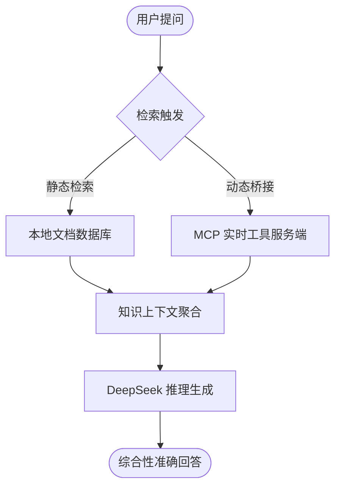

# RAG (Retrieval-Augmented Generation) 综合技术演示

本项目是一个完整的 RAG 技术学习示例，使用 LangChain 编排框架，覆盖了从基础检索到 **2026 前沿 Active RAG** 的 7 大核心模块。

## 🚀 核心功能演示

| 模块 | 功能 | 关键技术 |
| :--- | :--- | :--- |
| 📄 多格式加载 | 从多个文本文件加载知识 | `TextLoader` |
| ✂️ 智能切分 | 语义友好的递归切分 | `RecursiveCharacterTextSplitter` |
| 🗄️ 向量数据库 | Chroma 持久化语义存储 | `ChromaDB` + `MiniLM` |
| 🔀 混合检索 | 关键词 (BM25) + 语义加权融合 | `EnsembleRetriever` |
| 🗜️ 上下文压缩 | LLM 驱动的检索后内容精选 | `LLMChainExtractor` |
| 🤖 来源引用生成 | 回答附带知识来源 [来源 n] | `Source Attribution` |
| ⚡ **Active RAG** | **集成 MCP 实时工具增强检索** | **MCP Bridge** |

## 📂 目录结构 (已优化)
```text
rag_app/
├── main.py                    # RAG 核心入口 (含 7 大模块)
├── README.md                  # 本文档
├── source_data/               # 原始知识库 (.txt 文档存储)
└── vector_storage/            # ChromaDB 向量数据库持久化目录
```

## 🏁 快速开始
1. 确保已配置 `env/.env` 中的 API Key。
2. 运行演示：
```bash
python rag_app/main.py
```

## 🧠 主动 RAG (Active RAG) 流程图
在本项目中，我们通过 **MCP (Model Context Protocol)** 实现了主动增强检索：



## 🔬 技术亮点：Active RAG with MCP
本项目不仅检索本地文档，还通过 `mcp` 模块获取实时信息（如天气）。当模型发现本地知识不足以覆盖实时需求时，会自动融合来自 MCP 桥接的实时数据，提供超越静态文档的智能化回复。
